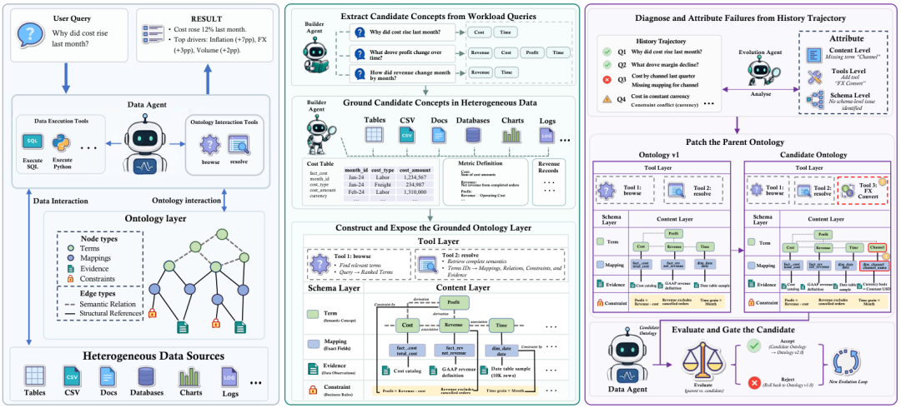
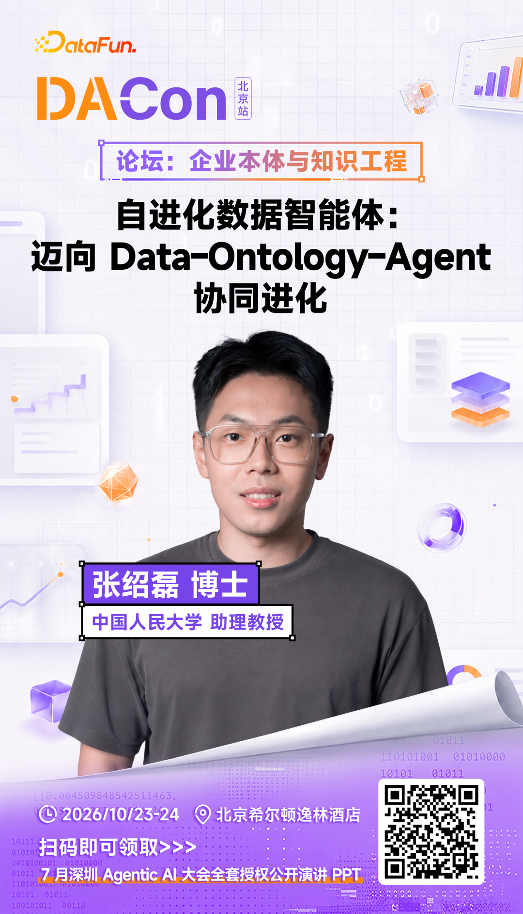
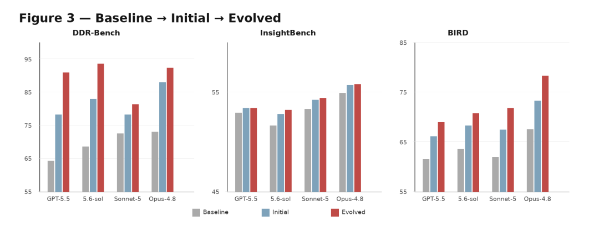
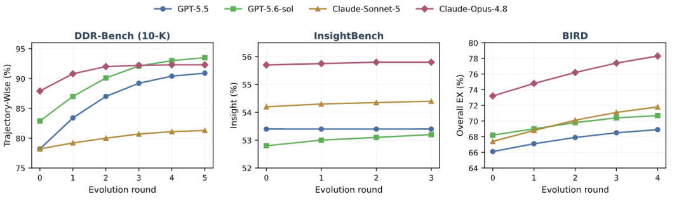
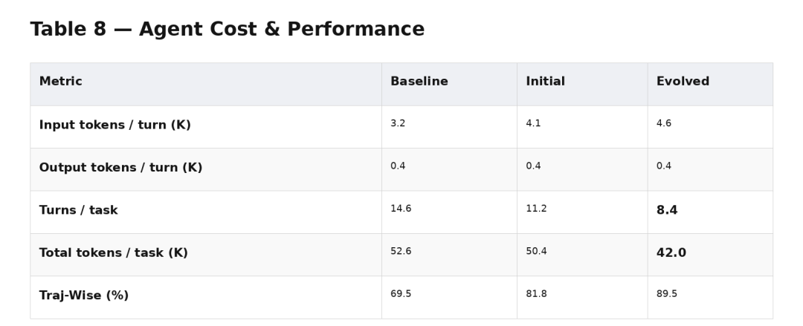
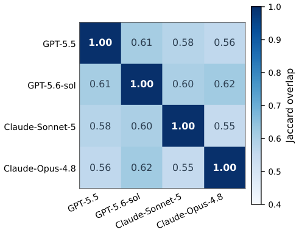
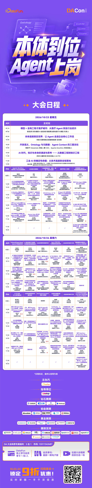

# 重磅开源EvoOntology：打掉本体“建设、维护、更新”难题

> 来源：DataFunTalk
> 链接（原文）：https://mp.weixin.qq.com/s/PirpvPKDnqI0TYHFZIBRyA

> 日期：2026-10-01
> 原始素材：`assets/evontology-self-evolving-ontology/`（original.html + 21 张图）

导读最近，在企业 Agent 的讨论里，Ontology 被提得越来越多。模型现在会写 SQL、调 API、读文件、跑代码，可一旦接进企业数据，还是常卡在更基础的问题上：同一个“客户”在不同系统里到底是不是同一个对象？“收入”该取订单金额、确认收入，还是回款？一个风险事件又该关联哪些账户和合同？这些业务含义，模型并不会天然知道。
Ontology 要做的，就是把这些业务概念、数据对象、字段关系和操作规则组织起来，让 Agent 明白企业数据到底代表什么。Palantir 在这方面做了很多年。最近，越来越多 Data Agent 和企业 AI 系统也开始重新强调 Semantic Layer、Knowledge Graph 和 Ontology。
主要内容包括以下几个部分：
1. 把 Semantic Layer 塞进 Prompt，未必真能帮到 Agent
2. Ontology 从一份说明书，变成 Agent 运行时查询的服务
3. Agent 的执行轨迹，开始反过来更新 Ontology
4. Ontology 越用越多，Agent 反而少走了很多弯路
5. 同一套业务知识，不同模型最后可能需要不同的 Ontology

但 Ontology 真正麻烦的地方，很快就会露出来：业务一直在变，数据表越来越多，字段含义会调整，Agent 使用数据的方式也在变。一套 Ontology 建好之后，谁来持续维护？
9 月 14 日，中国人民大学团队发布了论文《EvoOntology: A Self-Evolving Ontology Layer for Data Agents》，同时开放了代码。它想回答的就是这个问题。论文没有把 Ontology 当成一套靠数据团队长期人工维护的静态语义层，而是让 Agent 根据自己的任务和执行轨迹，持续修改它。EvoOntology 改的不只是维护方式，它连 Ontology 在 Agent 系统里的使用方式也一起改了。

图1｜EvoOntology 整体架构：Data Agent 经 Ontology 交互工具查询三层本体，并从执行轨迹中诊断失败、生成局部补丁

论文作者亲自现身，现场拆解自进化 Ontology！
10 月 23–24 日，DACon 2026 北京站将在北京希尔顿逸林酒店举行。
届时，EvoOntology 论文作者、中国人民大学信息学院助理教授张绍磊将来到现场，带来主题分享：《自进化数据智能体：迈向 Data–Ontology–Agent 协同进化》论文作者本人现场讲解：
为什么 Data Agent 的问题不能只靠换模型解决？

Content、Tool、Schema 三层 Ontology 如何补上 Agent 与企业数据之间的断层？

Ontology 又如何基于 Agent 的真实执行轨迹，通过轨迹归因、知识修正、成对评测与安全回滚持续自我进化？

如果你正在关注 Data Agent、Ontology、Semantic Layer、Agent 自进化，这场分享值得到现场听作者亲自拆解。

01

把 Semantic Layer 塞进 Prompt，未必真能帮到 Agent
现在给 Data Agent 补业务语义，常见做法是提前把表结构、字段说明、业务指标和实体关系整理好，再放进上下文。数据规模不大时，这很好理解，至少 Agent 不用每次重新猜 Revenue 对应哪张表、Customer ID 该和哪个字段关联。问题是，企业数据结构一大，Semantic Layer 自己就会越来越复杂。每次执行任务都把大量语义信息塞给模型，既占 Context，也会带进很多和当前任务无关的内容。
EvoOntology 在 DDR-Bench 上做了一组实验。以 Claude-Sonnet-5 为例，没有 Ontology 时，Trajectory-Wise 准确率是 72.5%；把准备好的 Semantic Layer 直接放进上下文，反而降到 57.5%；换成 EvoOntology 后，准确率提高到 81.3%。GPT-5.6-sol 上也是类似结果：普通 Baseline 是 68.5%，加入静态 Semantic Layer 后是 65.5%，EvoOntology 则到了 93.5%。在论文测试的六种模型上，EvoOntology 相比没有 Ontology 的 Baseline，Trajectory-Wise 平均提升了 17.8 个百分点。

图2｜DDR-Bench、InsightBench 与 BIRD 上 Baseline → Initial → Evolved 的性能变化
倒不是说 Semantic Layer 没价值，关键是 Agent 怎么用这些语义。把整套业务知识提前塞进 Prompt，它更像一本很厚的说明书。Agent 每次执行任务，都要从里面重新筛选真正需要的信息。Ontology 越复杂，这种做法越难扩展。EvoOntology 的思路，是把 Ontology 独立出来，做成一个 Agent 随时可以查询的 MCP Server。

论文作者亲自现身，现场拆解自进化 Ontology！
10 月 23–24 日，DACon 2026 北京站将在北京希尔顿逸林酒店举行。
届时，EvoOntology 论文作者、中国人民大学信息学院助理教授张绍磊将来到现场，带来主题分享：《自进化数据智能体：迈向 Data–Ontology–Agent 协同进化》论文作者本人现场讲解：
为什么 Data Agent 的问题不能只靠换模型解决？

Content、Tool、Schema 三层 Ontology 如何补上 Agent 与企业数据之间的断层？

Ontology 又如何基于 Agent 的真实执行轨迹，通过轨迹归因、知识修正、成对评测与安全回滚持续自我进化？

如果你正在关注 Data Agent、Ontology、Semantic Layer、Agent 自进化，这场分享值得到现场听作者亲自拆解。

02

Ontology 从一份说明书，变成 Agent 运行时查询的服务
EvoOntology 把 Ontology 分成三层：Content Layer、Schema Layer 和 Tool Layer。Content Layer 保存真正的业务语义，包括 Terms、Mappings、Constraints 和 Evidence。Terms 是业务概念，比如 Revenue、Customer；Mappings 把这些概念对应到底层数据表和字段；Constraints 记录数据使用时的限制；Evidence 则保留支撑这些判断的数据证据。也就是说，Ontology 里不会只写一句“Revenue 代表收入”。它还要说明，这个概念具体对应哪个字段、应该怎样关联、在什么条件下才能用，以及当初是根据什么数据确定下来的。
Schema Layer 管的是 Ontology 自己的结构。如果以后出现新的业务关系，现有结构描述不了，它也允许继续修改。Tool Layer 决定 Agent 怎么调用这些信息。EvoOntology 不会在每次任务开始时把整套 Ontology 全塞给模型，只给 Agent 一个比较轻量的 Manifest。Agent 真正开始执行任务后，再根据需要，通过 MCP 的 browse、resolve 等工具查询相关概念。比如 Agent 要研究一家公司的 Revenue，它可以先找到相关业务概念，再往下解析具体字段、映射关系和约束，不需要提前读完整个企业数据字典。
这样一来，变化很直接：Ontology 不再只是 Prompt 前面附带的一大段背景信息，而开始变成 Agent Harness 里一个独立的运行时服务。更重要的是，这套 Ontology 本身也不是固定的。
03

Agent 的执行轨迹，开始反过来更新 Ontology
EvoOntology 的初始 Ontology，并不要求完全靠人工建设。系统里有一个 Builder Agent。它会先读取一批真实任务，从里面寻找经常出现的实体、指标、操作和分析条件，再主动检查底层数据。比如 Builder Agent 判断某个字段可能对应 Revenue，它还要继续看字段类型、真实数据值和关联关系，确认这个映射合理，才会写进 Ontology，同时保存相关 Evidence。初始版本建好之后，EvoOntology 会继续利用 Agent 的执行轨迹更新它。

图3｜随进化轮次推进，四个模型在 DDR-Bench、InsightBench 与 BIRD 上的指标变化
Data Agent 开始跑任务后，会留下大量执行轨迹。有些任务做对了，有些可能找错表、选错字段，也可能 Ontology 里明明有正确内容，但 Agent 就是没找到。Evolution Agent 会分析这些历史轨迹，寻找重复出现的问题，再判断应该修改哪一层。如果 Agent 经常把一个业务概念映射到错误字段，可能需要改 Content Layer；如果正确信息已经存在，但 Agent 总是检索不到，可能应该调整 Tool Layer；如果新的业务关系根本没有合适的结构来表示，就可能要改 Schema Layer。找到问题后，系统不会重建整套 Ontology，而是生成一个局部 Patch。
修改不会马上生效。新的 Candidate Ontology 和原来的 Parent Ontology，会在同一组验证任务上重新跑一遍，模型、解码参数和执行预算都保持一致。只有新版本效果确实更好，修改才会被接受，否则继续保留旧版本。论文的消融实验也说明，这一步很重要。完整 EvoOntology 在 DDR-Bench 上的 Trajectory-Wise 指标是 89.5%；如果取消这层 Gate，让所有修改直接进入下一版本，结果降到 78.3%；如果取消 Attribution，不再判断错误应该归到 Content、Tool 还是 Schema，结果也会下降。
所以论文里的“Self-Evolving”并不是让 Agent 自由修改知识库。整个过程有一条很清楚的链路：跑任务、收集轨迹、找到失败模式、定位问题、生成修改，再通过验证决定是否接受。这样一来，Agent 在执行过程中留下的任务轨迹，也开始变成 Ontology 的更新依据。

论文作者亲自现身，现场拆解自进化 Ontology！
10 月 23–24 日，DACon 2026 北京站将在北京希尔顿逸林酒店举行。
届时，EvoOntology 论文作者、中国人民大学信息学院助理教授张绍磊将来到现场，带来主题分享：《自进化数据智能体：迈向 Data–Ontology–Agent 协同进化》论文作者本人现场讲解：
为什么 Data Agent 的问题不能只靠换模型解决？

Content、Tool、Schema 三层 Ontology 如何补上 Agent 与企业数据之间的断层？

Ontology 又如何基于 Agent 的真实执行轨迹，通过轨迹归因、知识修正、成对评测与安全回滚持续自我进化？

如果你正在关注 Data Agent、Ontology、Semantic Layer、Agent 自进化，这场分享值得到现场听作者亲自拆解。

04

Ontology 越用越多，Agent 反而少走了很多弯路
给 Agent 加一层 Ontology，很容易让人担心成本。多查一次 MCP，多读一层语义，理论上都会增加 Token。但 EvoOntology 的实验结果刚好相反。

图4｜Agent 成本与性能对比：轮均输入 Token 上升，但任务轮数与总 Token 明显下降
在 DDR-Bench 上，没有 Ontology 时，Agent 每一轮平均输入大约 3.2K Token，一个任务平均需要 14.6 轮，总 Token 消耗大约是 52.6K。加入初始 Ontology 以后，每轮输入增加到 4.1K，但平均任务轮数下降到 11.2，总 Token 变成 50.4K。随着 Ontology 继续进化，每轮输入继续增长到 4.6K，但完成任务只需要 8.4 轮，最终总 Token 降到 42K。
在 GPT-5.5、GPT-5.6-sol、Claude-Sonnet-5 和 Claude-Opus-4.8 这组四模型分析中，和 Baseline 相比，完成单个任务的总 Token 从 52.6K 降到 42K，下降约 20%，Trajectory-Wise 则从 69.5% 提升到 89.5%。原因不难理解。没有 Ontology 时，Agent 每次做任务都要重复探索：找表、看字段、检查取值、尝试 Join，再判断业务含义。Ontology 把其中一部分已经验证过的结果沉淀下来，后面的任务可以直接复用。虽然每一步多读取了一些语义信息，但减少了大量无效探索。
论文还把它和普通 Memory 做了对比。ReAct Baseline 的 Trajectory-Wise 是 69.5%，加入能够检索历史执行轨迹的 Memory 后提高到 75.8%，EvoOntology 则是 89.5%。Memory 保存的是过去某个任务怎么做过；Ontology 更进一步，把这些任务里的经验重新整理成可以查询和组合的结构。一个偏历史记录，一个更接近长期积累下来的业务规则。这也是为什么论文里的 Ontology 已经和传统意义上的知识库有些不同。它并不只是积累更多内容，而是在不断减少 Agent 下一次解决类似问题时需要重新探索的东西。

论文作者亲自现身，现场拆解自进化 Ontology！
10 月 23–24 日，DACon 2026 北京站将在北京希尔顿逸林酒店举行。
届时，EvoOntology 论文作者、中国人民大学信息学院助理教授张绍磊将来到现场，带来主题分享：《自进化数据智能体：迈向 Data–Ontology–Agent 协同进化》论文作者本人现场讲解：
为什么 Data Agent 的问题不能只靠换模型解决？

Content、Tool、Schema 三层 Ontology 如何补上 Agent 与企业数据之间的断层？

Ontology 又如何基于 Agent 的真实执行轨迹，通过轨迹归因、知识修正、成对评测与安全回滚持续自我进化？

如果你正在关注 Data Agent、Ontology、Semantic Layer、Agent 自进化，这场分享值得到现场听作者亲自拆解。

05

同一套业务知识，不同模型最后可能需要不同的 Ontology
论文还测试了一个问题：同一套 Ontology 能不能直接给不同模型共用。研究团队让 GPT-5.5、GPT-5.6-sol、Claude-Sonnet-5、Claude-Opus-4.8 从同一个初始 Ontology 出发，分别根据自己的执行轨迹继续进化。最终得到的 Ontology 并不一样。不同模型最终接受的 Term 之间，两两 Jaccard 重合度最高没有超过 0.62。研究团队随后又做了交叉实验，把一个模型进化出来的 Ontology 直接交给另一个模型使用，性能都会出现下降。使用自己进化出来的 Ontology 时效果最好，跨模型迁移至少下降 6.6 个百分点，部分情况下平均差距达到 10.9 个百分点。

图5｜同一初始 Ontology 下，四个模型各自进化所得 Ontology 的 Term 重合度（Jaccard）
这多少说明，同一份企业业务知识，并不代表所有 Agent 都应该用同一种方式去访问。企业里的客户、合同、订单和收入定义相对稳定，但这些内容应该怎样组织、哪些字段先暴露给 Agent、工具怎么返回结果，可能会和具体模型有关。
再看 EvoOntology 被接受的演化修改，Tool Layer 带来的累计增益占 57%，Content Layer 占 34%，Schema Layer 占 9%。也就是说，超过一半的收益来自“怎么让 Agent 使用 Ontology”，而不是继续往里面补更多知识。这和过去很多人对 Ontology 的理解有一点不同。以前企业建 Ontology，核心工作通常是把业务对象和对象之间的关系定义准确。进入 Agent 场景以后，业务语义本身依然重要，但 Agent 怎么查询、什么时候查询、查询到什么粒度，也开始变成 Ontology 的一部分。
当然，EvoOntology 现在仍然是一项研究工作。它的实验主要集中在 DDR-Bench、InsightBench 和 BIRD 这类 Data Agent Benchmark，真实企业里的权限控制、业务规则冲突、多人修改、审计和长期版本治理要复杂得多。论文保留 Parent/Candidate、验证和回滚机制，也说明所谓 Self-Evolving 并不是把 Ontology 完全交给 Agent，而是把一部分维护过程变成可以自动运行、自动验证的循环。
这个变化解决的是一个很现实的问题。一套业务语义层建好之后，如果业务、数据和 Agent 都不断变化，却始终依赖数据团队逐条维护，Ontology 自己迟早也会成为新的维护成本。EvoOntology 的做法，是把 Agent 真正执行任务时留下的轨迹也利用起来：哪里反复找错字段、哪里总检索不到已有知识、哪里现有结构已经描述不了新的关系，就针对这些问题修改 Ontology，再用验证任务决定是否保留。
这样看，Ontology 在 Agent 系统里的角色已经不太像一份提前写好的业务说明书了。它更像一个随着 Agent 工作不断更新的运行时组件：Agent 用它理解数据，也反过来通过自己的执行结果继续修正它。过去的问题是怎么给 Agent 建一套 Ontology，EvoOntology 往前走了一步——这套 Ontology 建好以后，Agent 自己也开始参与维护了。
参考来源
EvoOntology: A Self-Evolving Ontology Layer for Data Agents — https://arxiv.org/abs/2609.15779
RUC-DataLab / EvoOntology — https://github.com/ruc-datalab/EvoOntology

往期推荐

Data Agent多维归因分析与Skill化改造

重磅！吴恩达把AI技能树和程序员路线一起重画了

刚刚！AWS 开源 Strands Harness：Agent 开始只换模型、不换“身体”

快手把 Data Agent 铺到了全集团，靠的不是更强的模型

问数准确率从 50% 到 95%，高德只做对了一件事

Agent评测变天了！OpenAI、Anthropic都开始补课

Harness Engineering 的语义底座：本体驱动的 Agent 可控执行

企业AI还困在PoC，为什么Palantir增长了149%？

从 Workflow 到数字员工：一个生产级全链路数据 Agent 的架构与落地实践

Palantir AIPCon 11炸出新范式！拆了两年的AI Stack，开始重新“合并”

点个在看你最好看

SPRING HAS ARRIVED

