# KV Cache 机制详解

> 来源：亦行学社（原文“小H无记”）
> 链接（原文）：https://mp.weixin.qq.com/s/zQ0KFPa_8tqG-H1CAy8Jig
> 日期：2026年9月29日 18:49
> 原始素材：`assets/kv-cache-mechanism-explained/`（original.html + 28 张图）

Study in 2026.9

〇、一句话本质

KV cache = 用显存换计算：把「历史 token 的 K/V」存起来，自回归生成时只算新 token，避免 O(n²) 的冗余重算。

往下读，你会看到这句话的每个词都不是随口说的：为什么缓存的是 K/V 而不是别的、为什么是「历史 token」、为什么换来的是「计算」而不是别的。

先交代背景：长上下文推理（128K、1M context）是当前大模型的核心战场，而 KV cache 的显存和带宽正是长上下文的头号瓶颈。要搞懂 KV cache，得先搞懂它缓存的「KV」是什么、从哪来——这就要回到 Transformer 的起源，从 Attention 讲起。

一、Attention 是怎么来的：从 RNN 的困境到 Q/K/V

1.1 起源：RNN 的兴衰

1.1.1 RNN 是什么：一个循环的「记忆」单元
在 Transformer（2017）之前，处理序列数据（文本、语音、时间序列）的主力是 RNN（循环神经网络，Recurrent Neural Network）。它的思想可以追溯到 1980 年代的 Hopfield 网络、1990 年代的 Elman 网络；到了 2010 年代，它成了 NLP（自然语言处理）的绝对主力——机器翻译、语音识别、语言模型，几乎都用 RNN 及其变体（LSTM、GRU）。

RNN 的核心思想非常朴素：序列是有顺序的，前面的信息会影响后面的理解，所以需要一个「记忆」把前面的信息带到后面。这个「记忆」就是隐藏状态（hidden state）h，它每一步都在更新：
h_t = f(W·x_t + U·h_{t-1})

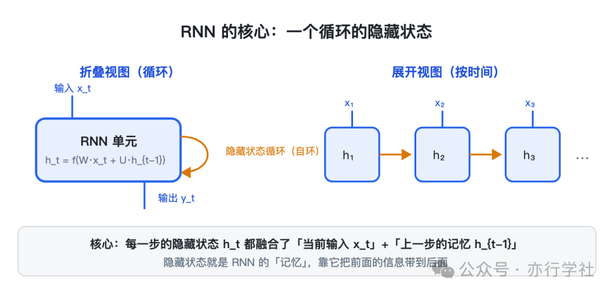

读这个公式：当前步的隐藏状态 h_t，融合了「当前输入 x_t」和「上一步的记忆 h_{t-1}」——这就是 RNN 的「记忆」机制，也是它名字里「循环（Recurrent）」的由来。

1.1.2 RNN 的优势

能处理变长序列：文本、语音长度不固定，RNN 天生适合。

参数共享：不管序列多长，每一步都用同一套 W、U——参数量不随序列长度增长，非常省参数。

理论上的「无限记忆」：隐藏状态 h 理论上能把任意长的历史信息「压缩」进去，让后面的 token 感知到前面的内容。

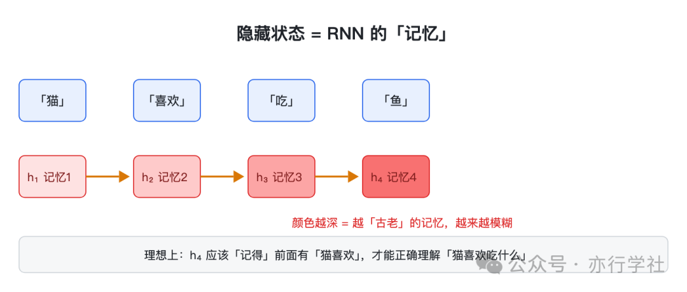

1.1.3 RNN 的两个致命问题
RNN 的优势很大，但两个致命问题，最终让它被 Transformer 取代：

问题① 串行，无法并行：必须一个 token 接一个 token 地算（因为 h_t 依赖 h_{t-1}），GPU 的并行算力用不上，训练极慢。

问题② 长距离依赖丢失（梯度消失）：训练时反向传播的梯度要「连乘」一路上传，每个因子都小于 1 时，梯度指数级衰减——传到序列开头时几乎为 0，远处的信息「训练不到」。

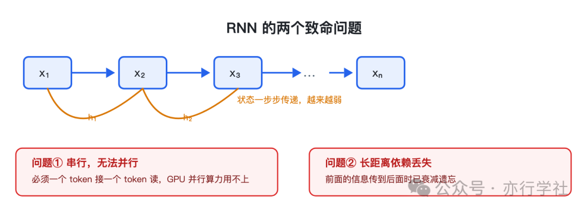

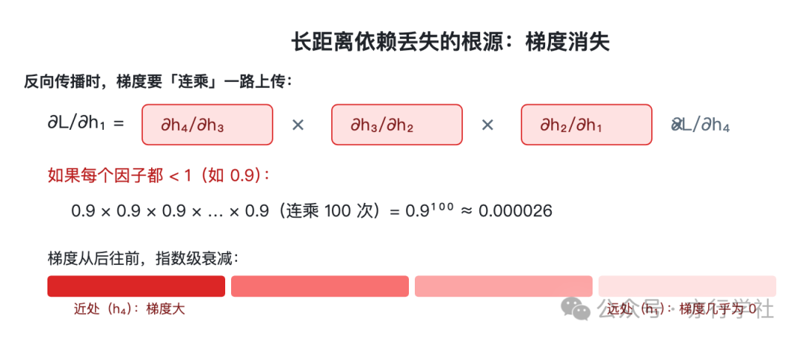

这两个问题的本质：问题①是「计算效率」问题（串行），问题②是「信息传递」问题（长距离衰减）。而后面要讲的 Attention，正是同时解决这两个问题的答案——这为 1.2 的「Attention 诞生」埋下了伏笔。

1.2 转折：Attention 的诞生（2014-2015）

2014 年，Bahdanau 等人提出 Attention 机制（用于机器翻译的 Seq2Seq），核心是一个颠覆性的想法：

与其让解码的每一步「只靠最后一步的隐藏状态」（RNN 的做法），不如让每一步「直接看到输入的所有位置」，自己决定该关注哪里。

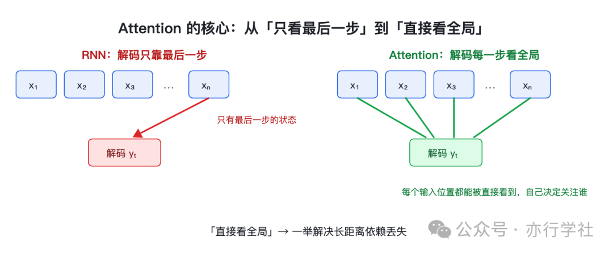

这个「直接看全局」的能力，一举解决了 RNN 的「长距离依赖丢失」——不管距离多远，注意力都能一步直达。

1.3 集大成：Transformer 与自注意力（2017）

2017 年，Google 的论文《Attention Is All You Need》把这件事推向极致：完全抛弃 RNN，只用 Attention。

关键创新是「自注意力（Self-Attention）」：让序列内部的每个 token，都和其他所有 token 建立「注意力关系」——一个 token 的含义，由它「关注」哪些其他 token 决定。

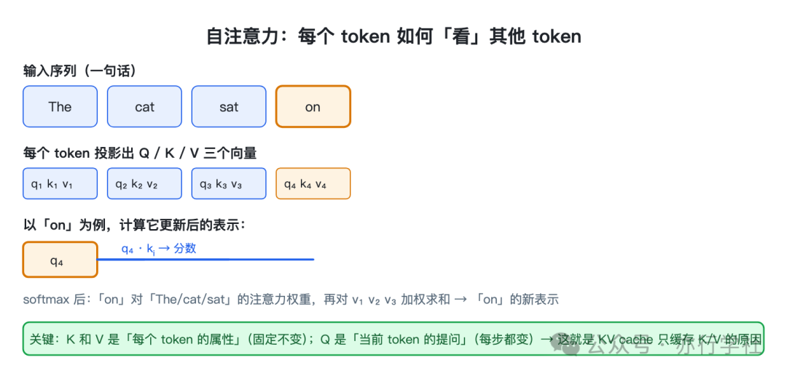

1.4 Q/K/V：怎么算、为什么这么算

1.4.1 计算：embedding 和三个投影矩阵
Q/K/V 的计算分两步：先把「文字」变成「向量」（embedding），再用三个矩阵投影成 Q/K/V。

第一步：token 变向量（embedding）——文本不能直接算，要先变成数字向量：

分词（tokenize）：把文本切成 token（"The cat" → "The"、"cat"）。

映射 id：每个 token 查词典得到一个编号（如 "The" → #1001）。

查 embedding 表：用 id 到「词嵌入矩阵」（词表大小 × d_model）里查一行，得到这个 token 的向量 x（如 4096 维）。

关于「映射 id」：这个 id 不是随便编的，它来自「词表（vocabulary）」，而词表是分词器用 BPE（Byte Pair Encoding，字节对编码）算法从海量语料里「长」出来的：
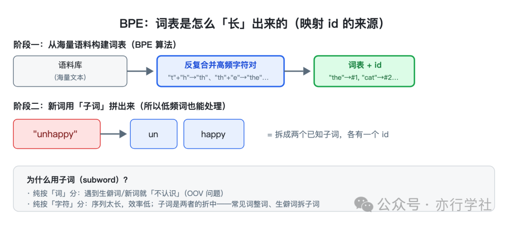

BPE 的思路：从「字符」开始，反复统计并合并「最高频的相邻字符对」（"t"+"h"→"th"，"th"+"e"→"the"…），直到词表达到目标大小（如 5 万）。结果是「高频词」是完整词（"the"、"cat"），「低频词」被拆成子词（"unhappy"→"un"+"happy"）。好处是：既能处理常见词，又不会「不认识」生僻词（OOV 问题）。

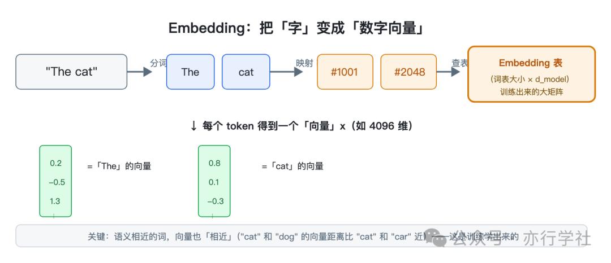

embedding 表怎么训练——它分两个时代：

早期（2013 Word2Vec）：专门训练词向量——用「上下文预测词」（CBOW）或「词预测上下文」（Skip-gram），让「出现在相似上下文里的词」向量相近。这就是「分布式假设」（distributional hypothesis）：语义相近的词，上下文也相似。

现代 LLM：embedding 表不再是单独训练，而是「整个模型的一部分」，随整个模型用「预测下一个 token」这个任务一起训练。反向传播时，embedding 表和其他参数一起更新，最终学会「把语义编码进向量」。

一句话：embedding 表一开始是随机的，靠训练「逼」它把语义相近的词放到相近的位置。

第二步：向量投影成 Q/K/V——拿到向量 x 后，用三个训练出来的矩阵 W_Q、W_K、W_V 做「矩阵乘法」（线性变换）：
Q = x · W_Q　　K = x · W_K　　V = x · W_V

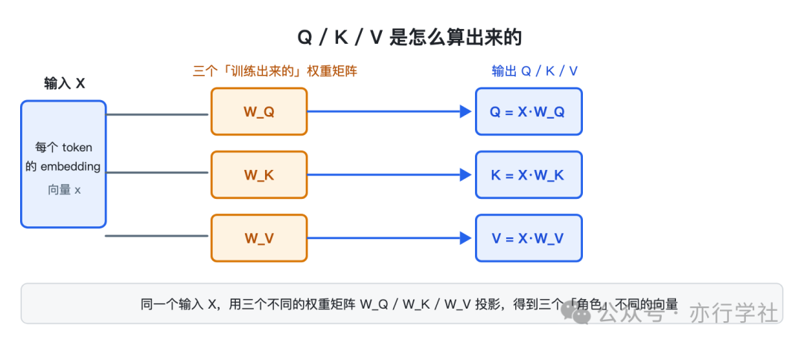

三个矩阵怎么来的：W_Q、W_K、W_V 都是 d_model × d_model 的矩阵，和 embedding 表一样「随机初始化 + 训练更新」。投影（x · W_Q）本质是一次「线性变换」——把 x 从「原始语义空间」变换到「查询空间 / 键空间 / 值空间」。

一句话总结：embedding 把「字」变成「语义向量」，三个矩阵再把「语义向量」投影成「提问(Q)、被匹配(K)、被取值(V)」三个角色。

1.4.2 为什么是「三个不同的投影」
关键点：一个 token 同时扮演三个角色，而这三个角色需要「不同的视角」：

作为 Q：它是「提问者」——「我想找什么信息」。

作为 K：它是「被匹配的标签」——「我能被什么信息找到」。

作为 V：它是「被取走的内容」——「我被找到后，能贡献什么」。

因为「提问」「被提问」「被取值」是三个不同的角度，所以不能用同一个投影，必须用三个不同的 W_Q、W_K、W_V 分别投影。

类比：同一个人，在图书馆里「找书」时是读者（Q），被检索系统「当标签」时是书（K），被借走「当内容」时是书的内容（V）——同一个对象，三个不同的角色，所以要三个不同的投影。

1.4.3 语义来源：为什么叫「查询-键-值」
Q/K/V 这个名字不是随便起的，它来自信息检索（Information Retrieval）和数据库的经典「查询-键-值（Query-Key-Value）」范式：

Query（查询）：你发起的「查询」。

Key（键）：数据里每条记录的「索引键」。

Value（值）：匹配到键之后，取回的「值」。

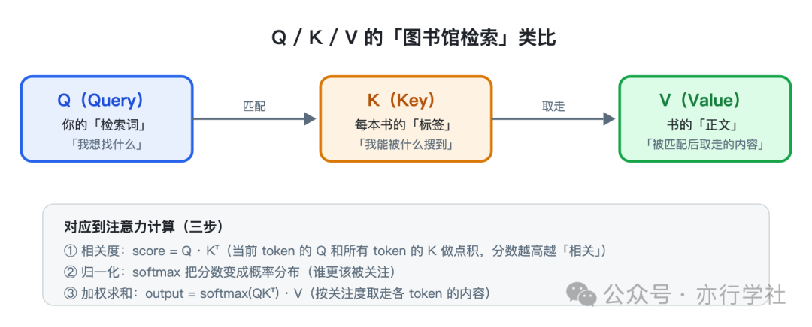

注意力计算三步：① 相关度 score = Q·Kᵀ；② 归一化 softmax；③ 加权求和 output = softmax(QKᵀ)·V。

关键观察（为第二章埋下伏笔）：K 和 V 是「每个 token 的属性」——只取决于这个 token 本身（x 和 W_K、W_V 都是这个 token 的），一旦算出来就固定不变；而 Q 是「当前这一步的提问」——每一步的「当前位置」不同，Q 就不同。这个区别，就是后面「为什么缓存 K/V、不缓存 Q」的根源。

二、Attention 的完整流程 + 自回归

第一章讲了 Q/K/V 怎么算，这一章把它们串起来——先看 attention 的完整流程，再看自回归怎么反复用它，这会自然引出「因果掩码」和「KV cache」。

2.1 Attention 的完整流程（回顾）

一个 token 的 attention 输出，分三步算：

算相关度：score = Q · Kᵀ（当前 token 的 Q 和所有 token 的 K 点积）。

归一化：softmax 把分数变成概率（谁更该被关注）。

加权求和：output = 概率 · V（按关注度取走各 token 的内容）。

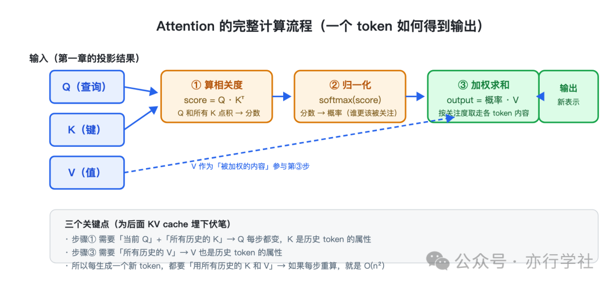

注意这张图里的三个关键点——它们直接决定后面 KV cache 的设计：
步骤① 需要「当前 Q」+「所有历史的 K」；步骤③ 需要「所有历史的 V」。

而 Q 每步都变（当前提问），K 和 V 是历史 token 的属性（固定不变）。

2.2 自回归：一次一个 token，反复跑 attention

LLM 是「自回归」生成：一次只预测一个 token，然后把新 token 拼回输入，再预测下一个。生成 "Time flies fast" 的过程是：

输入 "Time" → 生成 "flies" 
输入 "Time flies" → 生成 "fast" 
输入 "Time flies fast" → 生成下一个 token

关键：每一步都要跑一遍完整的 attention（上面那三步）。而不做优化的话，每一步都要把「前面所有 token 的 K/V 重新算一遍」——因为步骤①和③需要所有历史的 K 和 V。序列越长，重复计算越多，总计算量是 O(n²)。这就是生成长文本时「越到后面越慢」的原因。

一个几乎人人都会卡住的疑问：预测 "fast" 时，Q 是谁的？

答案：Q 是 "flies" 的（最后一个已生成 token），不是 "fast" 的——"fast" 还没预测出来，它没有 Q。

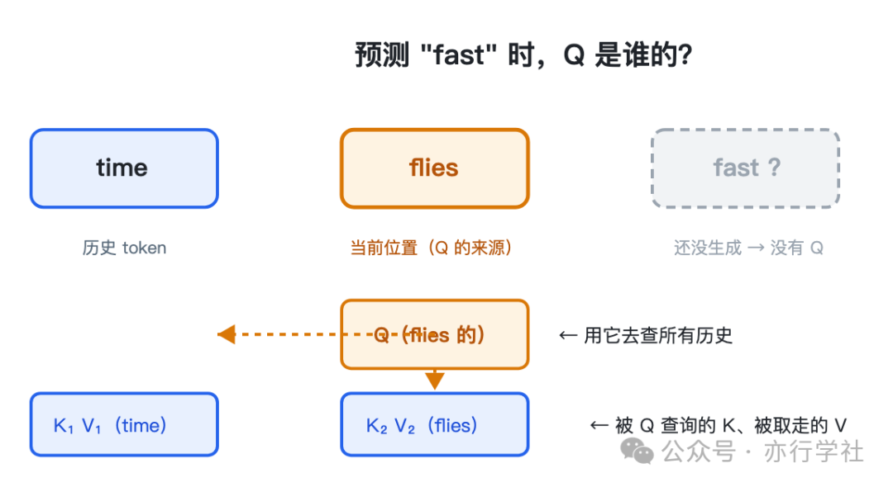

规律是：预测第 N 个词时，Q 来自第 N-1 个词（最后一个已生成的），K/V 来自前 N-1 个词（全部历史）。"fast" 的 Q，要等「预测 fast 的下一个词」时才出现。

类比：读填空题 "Time flies ____"，你（Q）站在 "flies" 后面，眼睛扫过 "Time"、"flies"（用 Q 查 K/V），然后猜空格填什么（预测 "fast"）。空格里的词还没出现，它不可能「提问」，只能「被预测出来」。

2.3 因果掩码 → KV cache 的诞生

但这里有一个关键洞察，来自「因果掩码」（causal mask）：
自回归生成时，当前 token 只能看到它前面的 token（不能看未来）。这意味着：一个历史 token 的 K 和 V，不会因为它后面又生成了新 token 而改变。

既然历史 token 的 K/V 是「一成不变」的，那它们「算一次、永久复用」就是天经地义的——这就是 KV cache 成立的逻辑基础。

数据支撑：无缓存 vs 有缓存的实测，约 5 倍速度差（小模型上，无缓存 13.7s vs 有缓存 2.8s）。

下一章（第三章）就正式讲 KV cache 具体怎么「缓存 K/V、不缓存 Q」。

2.4 输出向量怎么变回 token（lm_head）

前面讲的是「token 怎么变成向量」（embedding），这里补上闭环的另一半——最后输出的向量，怎么变回预测的 token。

答案：不是「查表反查」，而是经过 lm_head（语言模型头）——一个线性层，把 512 维向量投影到「词表大小」维，再 softmax 取最大：

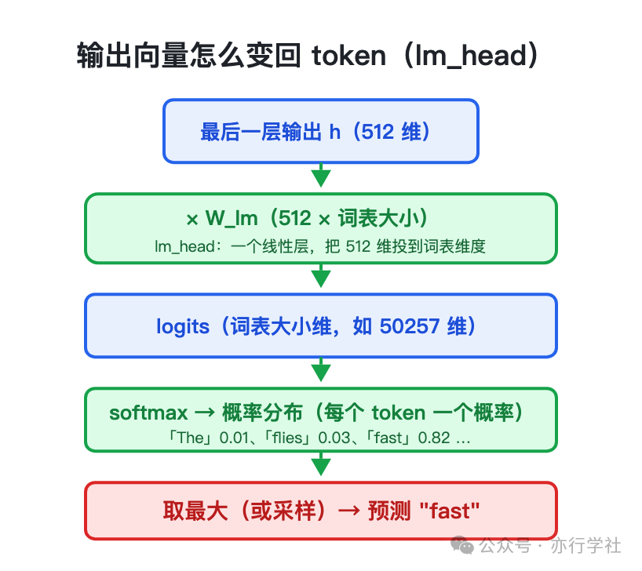

关键一步是 logits = h · W_lm：h 是 512 维，W_lm 是「512 × 词表大小」的矩阵，乘出来是「词表大小」维——logits 的每个维度，就对应一个 token 的得分。softmax 之后变成概率，取最大（或采样）就是预测的 token。

为什么像「查表反查」：很多模型的 lm_head 权重 = embedding 表的转置（权重共享，tie weights）。所以「输入查 embedding 表」和「输出乘 lm_head」用的是同一个矩阵 E，方向相反：

输入：token id → 取 E 的第 id 行 → 向量（查表）

输出：向量 → 乘 Eᵀ → 词表维分数 → 取最大 → token id（反查）

直觉：一个 token 的 embedding 就是「这个 token 的语义坐标」，最后一层的 h 是「当前要预测内容的语义坐标」。h 和某个 token 的 embedding 越「近」（点积越大），就越可能是这个 token——所以「取点积最大」=「找和 h 最像的 token」。

三、KV Cache 原理：缓存什么、不缓存什么

基于上面的洞察，KV cache 的做法是：

缓存 K 和 V：每个历史 token 的 K/V 算一次，存进显存，后面直接复用。

不缓存 Q：因为「预测下一个 token」只需要「当前 token 的 Q」——历史的 Q 只服务于「当时那一步」，后续步骤用不上。

于是推理被清晰分成两个阶段：

Prefill（预填充）：一次性并行处理整个 prompt 的所有 token，算它们的 K/V，生成第一个 token。算力密集，决定 TTFT（首 token 时间）。

Decode（解码）：从第二个 token 起，每步只算「当前新 token」的 Q/K/V，把新 K/V 追加（concat）到缓存，用新 Q 和「全部缓存的 K/V」算注意力，生成下一个 token。串行，逐 token 生成。

关键：Decode 阶段是「带宽敏感」，不是「算力敏感」——每步只算一个新 token（算力需求极小），但要「读」全部的 KV cache（数据量巨大）。这一句是理解后面「存储层级」和「KV cache 优化」的关键。

四、显存代价：KV Cache 到底占多大

前置：先懂 Transformer 和 Attention 的本质（基于《Attention Is All You Need》）

先看整张全景图——从输入到输出的完整结构（注意「× N 层」和「多头」两个关键概念）：

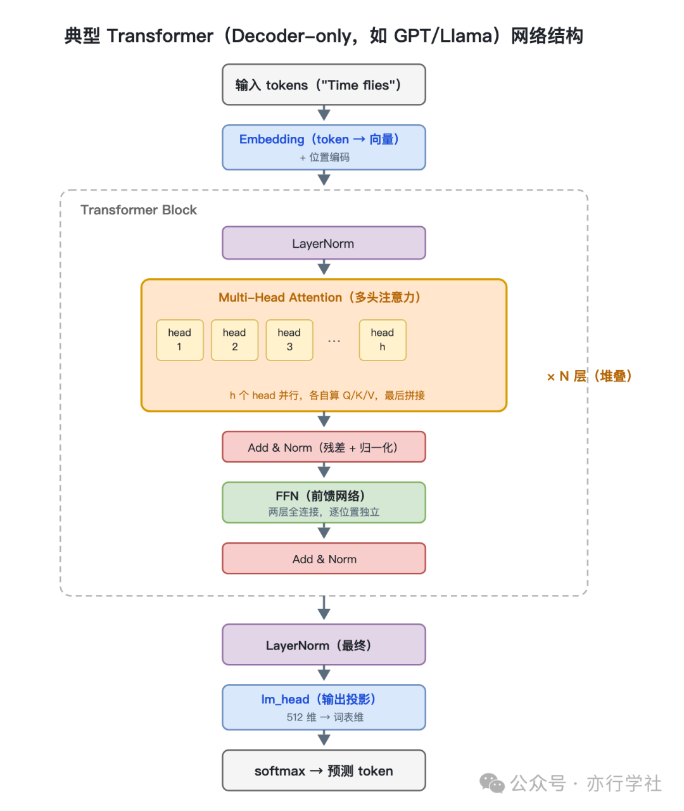

KV cache 的「KV」来自 attention，而 attention 的本质是论文里的核心公式——缩放点积注意力（Scaled Dot-Product Attention）：

Attention(Q, K, V) = softmax( Q·Kᵀ / √d_k ) · V

读这个公式：当前 token 的 Q 和所有历史 token 的 K 做点积（算相关度）→ 除以 √d_k 缩放 → softmax 归一化 → 加权求和 V。这就是 attention 的全部。而「Q 每步变、K/V 是历史 token 的属性」这个性质，就藏在这个公式里——它是 KV cache 成立的根源。

再看 Transformer 的「一层」长什么样（论文里 encoder/decoder 每层都是这个结构）：

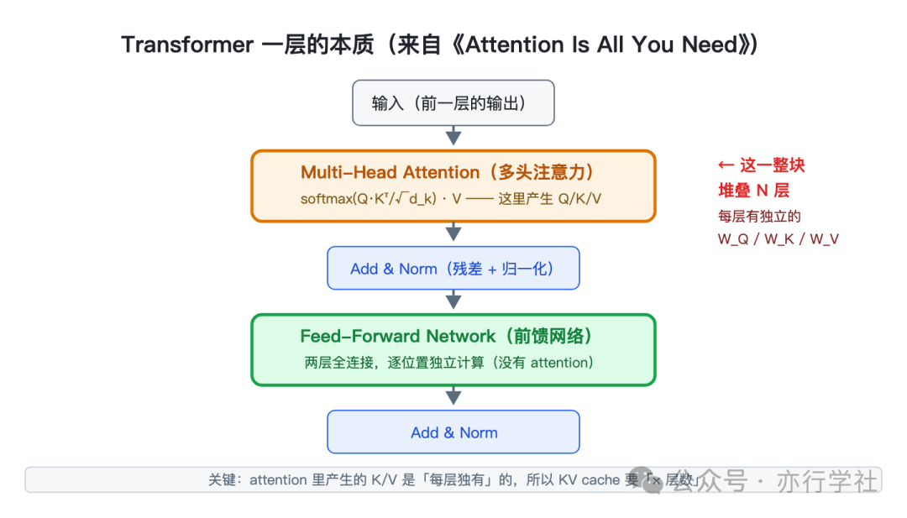

这一层 = Multi-Head Attention（产生 K/V）+ FFN（前馈网络），然后堆叠 N 层。每层有独立的 W_Q / W_K / W_V，所以每层的 K/V 都不同——这就是「KV cache 要 × 层数」的根源。

为什么需要「多层」堆叠？

因为一层 attention 只能做「一次浅层的信息混合」（softmax(QKᵀ)·V 只是一次加权组合），只能学到「词与词」的直接关系。要表达「深层、组合、抽象的语义」，必须堆叠多层，让信息逐层提炼：

第 1 层：学到词与词的局部关系（"cat" 和 "sat" 相关）。

第 2 层：在上一层基础上，学到短语结构（"the mat" 是一个整体）。

第 3 层：学到句法关系（主语、谓语、宾语）。

更高层：学到全局语义（整句话描述了一个场景）。

这跟 CNN 堆深度学「边缘 → 纹理 → 物体」是同一个道理：深度 = 表达能力。而且同样的参数量，「堆深」比「加宽」更能表达复杂函数（深度神经网络的万能近似）。

这也解释了为什么「每层都要存 KV」：既然信息要逐层提炼，每一层都有自己的「中间表示」（这一层的 K/V），自回归时每层都要复用「自己这层的历史 K/V」——所以 KV cache 要「× 层数」。

前置：先搞懂「多头注意力」，公式才看得懂

第 4 章公式里的「层数、KV头数、头维度」，都来自 attention 的「多头（multi-head）」结构。一个 token 的向量不是「一整块」做 attention，而是被切成多个「头」，每个头独立算自己的 K/V：

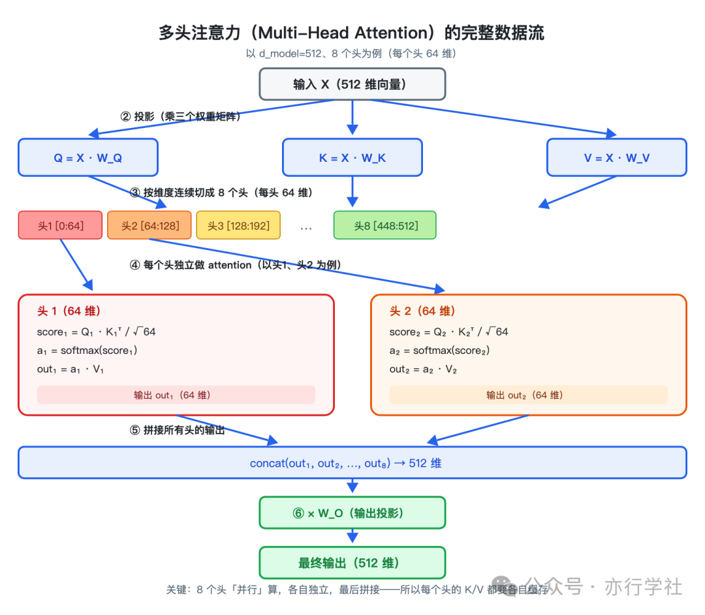

三个关键关系：头数 = 向量切成几个头；头维度 = hidden ÷ 头数（如 4096 ÷ 32 = 128）；层数 = 这样的多头注意力块堆叠了几层。每个「头」都有一份 K/V，每份长度 = 头维度——这就是 KV cache 要「层 × 头 × 维度」铺开的原因。

KV cache 是「用显存换计算」，代价就是显存。这一章把「大小到底怎么算出来」一步步讲清楚。

4.1 公式逐项拆解

总 KV cache 大小的公式是：
KV = 2 × batch × 层数 × KV头数 × 头维度 × token数 × 字节/元素

每一项的含义：

2：K 和 V 各一份（两个都要缓存）。

batch：并发处理的序列数（同时服务几个请求）。

层数：模型有多少层，每一层都要存自己的 K/V。

KV头数：每层有多少个 KV 头（MHA 头多、GQA 头少）。

头维度：每个头的 K/V 向量的长度。

token数：序列长度（上下文多长）。

字节/元素：精度（FP16=2、FP8=1、INT4=0.5）。

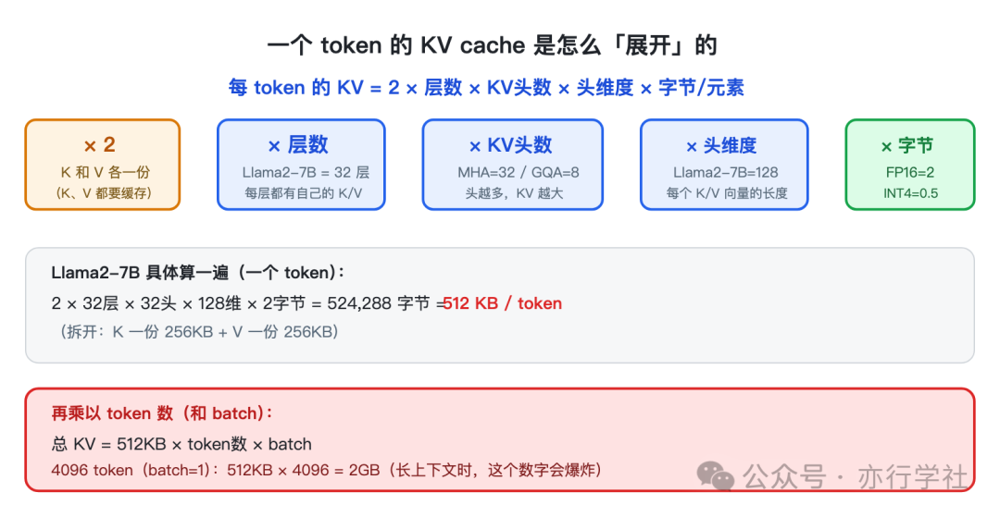

关于「token 数」：它 = prompt 的 token 数 + 已经生成（decode）出来的 token 数。KV cache 是「边生成边增长」的——prefill 阶段一次性缓存 prompt 所有 token 的 KV，decode 阶段每生成一个新 token 就追加一个新 token 的 KV。所以序列越长（长上下文），KV 越大。

4.2 为什么和「网络结构」有关
先回答一个最常见的疑问：为什么每一层都要存一份 KV？

因为 Transformer 是「多层堆叠」的，每一层都有自己独立的一套权重（W_Q / W_K / W_V），所以每一层的 K/V 是「这一层独有的向量」——第 1 层的 K¹V¹ 和第 2 层的 K²V² 是用不同权重算出来的，完全不同。

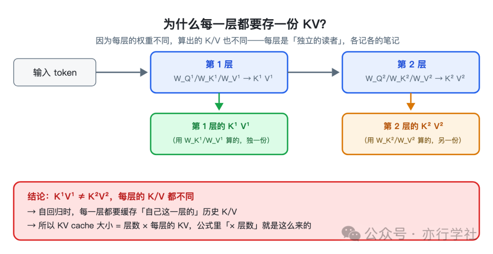

所以自回归时，每一层都要缓存「自己这一层的」历史 K/V，才能下一步复用——这就是公式里「× 层数」的来历。

看公式就明白：KV cache 的大小，一大半由「网络结构」的四个参数决定——层数、KV头数、头维度、精度。同一个模型，结构一旦定了，「每个 token 的 KV 大小」就是一个固定常数，KV cache 只会随「token 数」线性增长。

层数越多 → KV 越大（每层都存一份）。

KV 头越多 → KV 越大（MHA 32 头 vs GQA 8 头，差 4 倍）。

头维度越大 → KV 越大（hidden 越大，头维度越大）。

精度越高 → KV 越大（FP16 2字节 vs INT4 0.5字节，差 4 倍）。

4.3 具体算例：Llama2-7B 一步步算

Llama2-7B 的网络结构：32 层、32 个 KV 头（MHA）、头维度 128、FP16。一步步算「一个 token 的 KV」：

先算「一个 token、一层、一个头」的 K 向量：128 维 × 2 字节 = 256 字节。

一层有 32 个 KV 头：256 × 32 = 8KB（一层、一个 token 的 K）。

K 和 V 各一份：8KB × 2 = 16KB（一层、一个 token 的 K+V）。

32 层：16KB × 32 = 512KB（一个 token 的全部 KV）。

所以 Llama2-7B 每个 token 的 KV cache = 512KB。
再乘以 token 数：4096 token（batch=1）= 512KB × 4096 ≈ 2GB。这就是「Llama2-7B 4096 ctx ≈ 2GB」的来历。

4.4 MHA vs GQA：为什么 GQA 省 8 倍

关键在「KV 头数」：MHA 每个 Q 头都有独立的 KV 头（32 个 Q 头 = 32 个 KV 头）；GQA 让多个 Q 头共享一个 KV 头（比如 Qwen3 的 32 个 Q 头只配 4 个 KV 头，8:1 共享）。

因为 KV 大小正比于「KV 头数」，所以 GQA（4 头）比 MHA（32 头）省 8 倍；更激进的 MQA（只 1 个 KV 头）省 32 倍。（Llama2-70B 也是 64 头 MHA → 8 头 GQA，同样省 8 倍。）

4.5 长上下文爆炸

KV cache 随 token 数线性增长。256K 上下文的模型：512KB × 256K = 128GB，超过单卡显存——这就是 KV cache 优化的核心痛点。

五、优化技术全景（六个维度）

围绕「怎么让 KV cache 更小、更快」，有六个优化维度，每个都对应一个具体痛点：

架构层：MHA → MQA → GQA。MQA 所有头共享一套 KV，GQA 分组共享（折中）。核心是「减少 KV 头数量」，直接降低显存斜率。

量化层：KV 从 FP16 → INT8/FP8/FP4，内存省 2-4 倍。FP8 比 INT8 更能处理离群值，精度损失更小，但需硬件支持。

内存管理层：PagedAttention（vLLM），把 KV cache 切成固定大小的「页」，像虚拟内存分页一样管理，解决碎片化，提高 GPU 利用率。

计算层：FlashAttention，IO 感知的融合内核，避免完整注意力矩阵写回 HBM，内存从 O(n²) 降到 O(n)。

驱逐层：StreamingLLM（attention sink + 滑动窗口）、H2O（重击 token 驱逐）、SnapKV（观察窗口压缩）——识别「重要 token」保留，驱逐「不重要 token」。

层级存储：InfiniGen / InfLLM，把「热 KV」放 GPU、冷 KV 卸载到 CPU/存储，层级化降低显存。

六、实战：国内四大开源模型的 attention 与 KV cache 设计

6.1 DeepSeek：MLA（多头潜在注意力）

DeepSeek 从 V2 起用 MLA，是「低秩压缩 KV」路线的代表，也是最激进的 KV cache 优化之一。

路线：把「多头 K/V」压缩成「每 token 一个低维潜向量 c^KV」，缓存的是潜向量，不是完整 K/V。

效果：KV cache 减少 93.3%，最大生成吞吐提升 5.76 倍。

三步机制：① 低秩下投影压缩（W^DKV）② 按需上投影解压（W_uk / W_uv）③ 解耦 RoPE + 矩阵吸收。

下面这张图展示了 MLA 的完整流程——「写入时压缩缓存潜向量、读取时解压还原 K/V」：
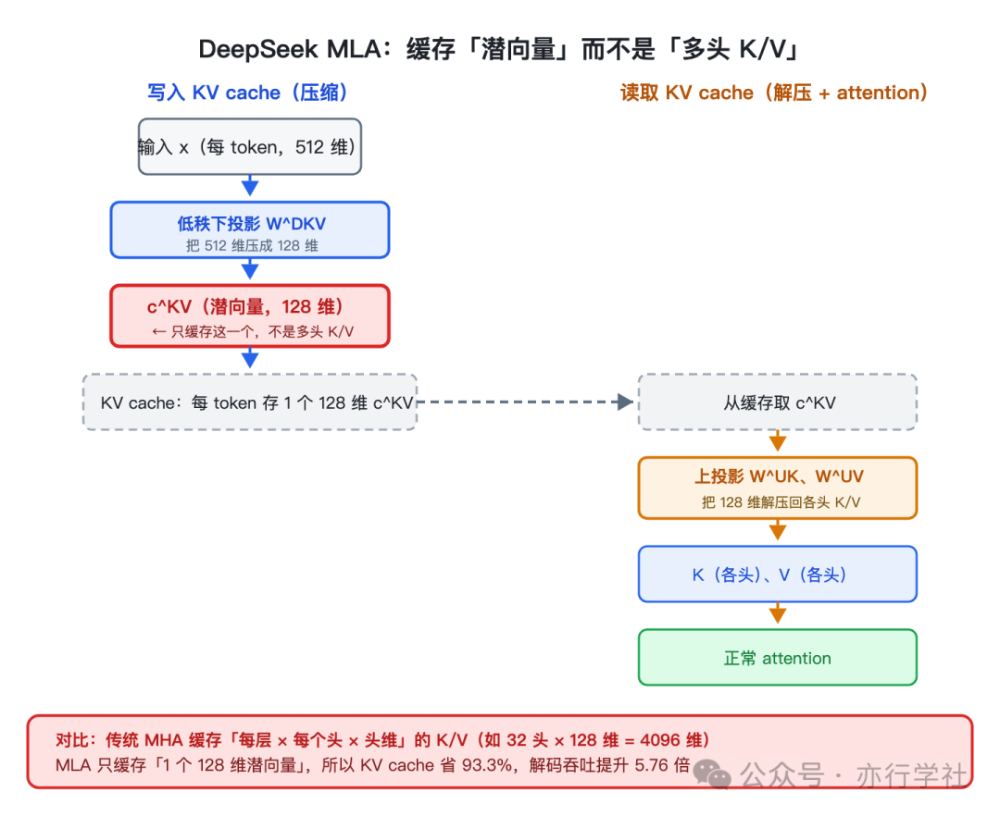

本质：和 GQA「共享 KV 头」不同，MLA 是「压缩 KV 内容」——保持多头结构，压缩维度。cache 规模相当于「只有 2.25 组的 GQA」，但表达能力可超过完整 MHA。

会损失 KV 信息吗？

会，但损失的是「冗余」，不是「有效信息」——而且压缩是训练学出来的，所以实际性能几乎不降，甚至更好。

数学上有损：把多头 K/V（如 4096 维）压缩成潜向量（128 维），降维必然损失信息。

但性能不降：因为压缩矩阵 W^DKV / W^UK / W^UV 是「训练中一起学的」，不是「事后硬压」——模型学会把 KV 的有效信息保留在低维潜向量里、丢掉冗余（这是关键区别）。

低秩假设：多头 KV 有大量冗余（不同头信息重叠），有效秩远小于名义维度，所以压到低秩只丢冗余、不丢有效信息。

实际结果：MLA 的 KV cache 规模 = 2.25 组 GQA，但表达能力可超过 MHA。

6.2 Qwen：GQA → Gated DeltaNet

Qwen 走了「从 GQA 到线性注意力」的演进路线，两代思路完全不同：

Qwen3：GQA（分组查询注意力）——核心是「让多个 Q 头共享 KV 头」，用「减少 KV 头数」来省 KV cache，而 Q 头数不变（保持表达能力）：

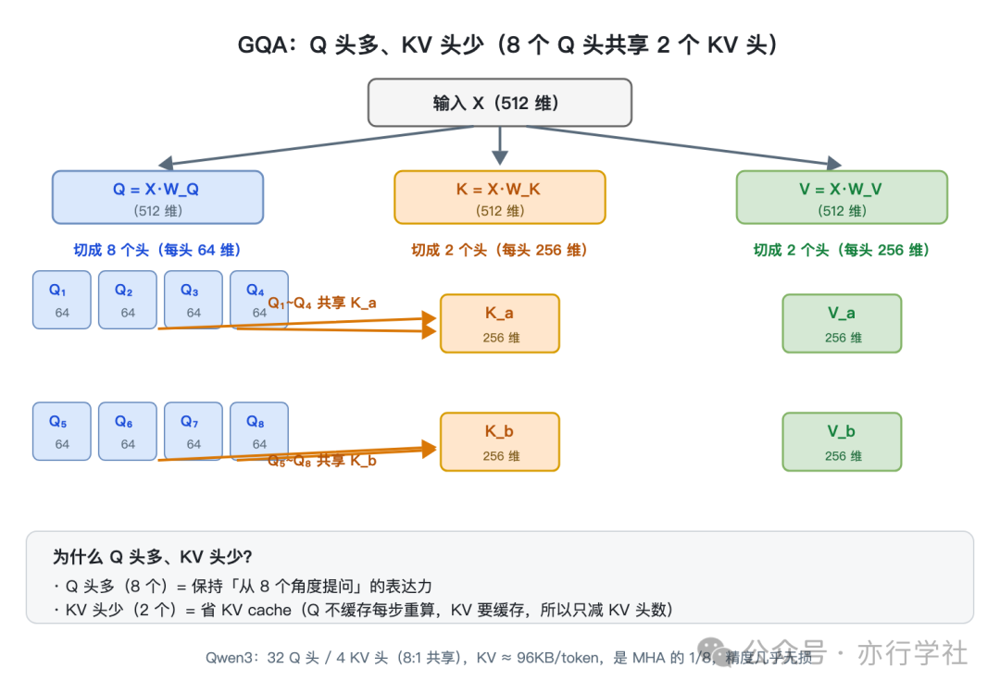

Qwen3 典型配置：32 个 Q 头 / 4 个 KV 头（8:1 共享），head_dim 128，KV ≈ 96KB/token。还加了 QK-Norm（对 Q/K 归一化）提升训练稳定性。但 GQA 复杂度仍是 O(n²)——它只压缩了 KV 头数，没改变「每个新 token 要看所有历史」的本质。

Qwen3.5+：Gated DeltaNet（线性注意力）——范式级改变，不再用 KV cache，改用「固定大小的循环状态」：

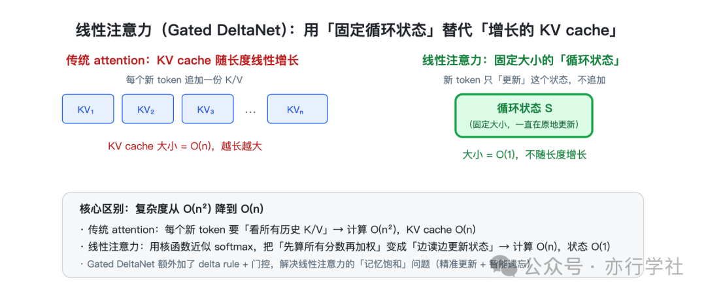

核心思想：用核函数近似 softmax，把「先算所有分数再加权」变成「边读边更新状态」，复杂度从 O(n²) 降到 O(n)。Gated DeltaNet 额外加了 delta rule（精准更新）+ 自适应门控（智能遗忘），解决线性注意力的「记忆饱和」问题。

拆开理解这个名字：Delta + Gated

DeltaNet：线性注意力，用「固定状态 S」替代「随长度增长的 KV cache」。

Delta（delta rule）：更新状态时「先擦旧、再写新」（S = S - S·k·kᵀ + β·k），解决线性注意力的「记忆饱和」（旧 key 干扰新 key）。

Gated（门控）：用门 β 控制「该更新多少」，实现「智能遗忘」——重要的记住、过时的忘掉。

状态 S 怎么设计——它是线性注意力的核心：
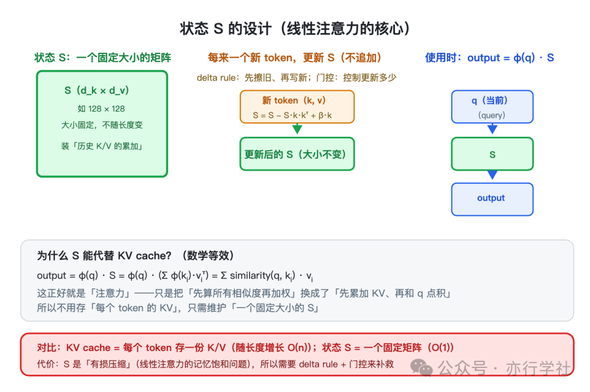

一句话：S 是一个「固定大小的矩阵」（d_k × d_v），装「历史 K/V 的累加」，用它代替 KV cache。因为 output = φ(q)·S 数学上等效于注意力，所以不用存每个 token 的 KV，只需维护一个 S。代价是「有损压缩」（记忆饱和），所以需要 delta rule（精确更新）+ 门控（智能遗忘）来补救。

为什么它没有「完全解决」KV cache 爆炸，大家只学「混合」？
因为线性注意力本质是「有损压缩」——把「每个 token 的 KV」压进「一个固定大小的状态 S」，状态容量有限，长上下文会「记忆饱和」（旧的被新的挤掉）。这在「多跳推理」「长距离依赖」上暴露得很明显（MiniMax 实测：SFT 后超 32K 上下文的多跳推理有严重缺陷）。

所以它不是「银弹」，而是「用精度换显存」的权衡——大家的选择是「3:1 混合」（75% 线性层省显存 + 25% 全注意力层保精度），而不是「完全替代」：

Qwen3.5：Gated DeltaNet + 全注意力（3:1）

Kimi K3：69 层 KDA + 24 层 MLA

GLM-5.3：KDA + 全注意力（3:1）

此外还有两个现实障碍：硬件/生态不匹配（现有 GPU 和 FlashAttention 都为 softmax 注意力优化，线性注意力的「循环状态更新」需要全新 kernel）；训练更难（需要特殊优化器如 Muon）。

6.3 GLM：MHA → MLA+DSA → KDA

GLM 的演进，核心是「怎么压缩 KV」。三种算法从三个不同维度压缩 KV：
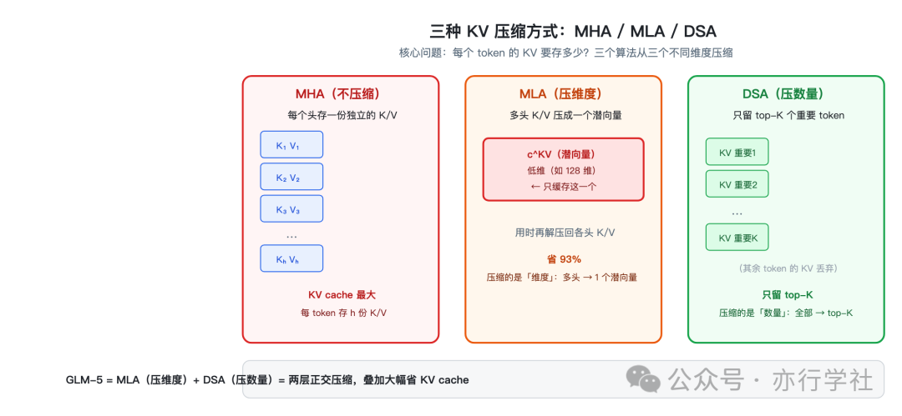

逐个讲清楚三个算法的具体算法：

MHA（多头注意力，不压缩）：Q/K/V 各切 h 个头，每个头独立做 softmax(QKᵀ/√d)·V。每个 token 存「每层 × 每个头」的 K/V，KV cache 最大。

MLA（多头潜在注意力，压维度）：① 下投影 c^KV = W^DKV·x（把 x 压成低维潜向量）② 缓存 c^KV（而非多头 K/V）③ 用时上投影 K = W^UK·c^KV、V = W^UV·c^KV 解压回各头。它压缩的是「维度」——多头 K/V 变成一个潜向量。

DSA（动态稀疏注意力，压数量）：① 计算每个 token 的注意力分数 ② 选 top-K（如 2048）个最重要的 token ③ 只对这 K 个做完整注意力，其余 KV 丢弃。它压缩的是「数量」——全部 token 变成 top-K。

DSA 的「选 top-K」发生在哪个阶段？
答案是 decode 阶段——prefill 阶段照常做稠密注意力（不稀疏）。这正好呼应前面「prefill 算力敏感、decode 带宽敏感」：

Prefill：并行、一次性算所有 prompt token，瓶颈是「算力」（GPU 能吃饱），稀疏省不了多少，所以做稠密。

Decode：逐 token、每个都要读全部历史 KV，瓶颈是「带宽」，选 top-K 只读最相关的 K 个 KV，省大量带宽——所以在这里做稀疏。

而且 decode 的 top-K 还能「复用」——上一步选的 top-K 和下一步高度相关（时间相关性），可以「猜 + 验证 + 修正」，不必每次从头算；prefill 没有上一步可复用，硬算反而更贵。

补充：注意力分数怎么算——就是 Q 和 K 的矩阵乘（点积）score = Q·Kᵀ/√d_k（当前 token 的 Q 和所有 token 的 K 点积，每个 token 一个分数，分数越大越相关）。DSA 里「算分数选 top-K」那一步，用的就是这个。

一个重要澄清：DSA 省「计算」，不省「存储」
DSA 是「动态」稀疏——每个 query 选「不同的」top-K，所以任何一个 token 的 KV 都可能被某个 query 需要，不能「只存一部分」。因此 KV cache 还是全量存，DSA 省的是 decode 时的「读取带宽 + 注意力计算」，存储量一点没省。

那「存储量」靠谁省？靠 MLA。这正是 GLM-5 把两者组合的原因——分工不同：

MLA：省「存储」（每个 token 的 KV 从多头压成一个潜向量，KV cache 变小）。

DSA：省「计算」（decode 只对 top-K 做注意力，省读取带宽和计算）。

类比：MLA 把每本书「压成摘要」（书变薄，省书架空间=存储）；DSA 找资料时只翻「最相关的 20 本」（省翻书时间=计算）。书一本没少（DSA 不省存储），书变薄（省存储）是 MLA 的功劳。

DSA 的三步流程（重点看「算分数 → 选 top-K → 精确注意力」）：

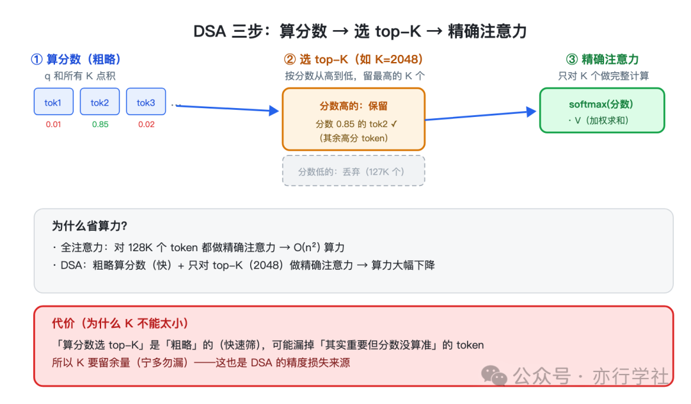

所以 GLM 的演进逻辑是「一层层加压缩」：

GLM-4.7：MHA——不压缩，KV 最大（≈962KB/token，是 Qwen3 的 10 倍）。

GLM-5：MLA + DSA——两层正交压缩：MLA 压「维度」（每 token 的 KV 变小），DSA 压「数量」（只留 top-K token），叠加大幅省 KV。

GLM-5.3：KDA——转向线性注意力（KDA 是 Kimi 原创，GLM 也采用了）。

6.4 Kimi：KDA（线性注意力）+ MLA 混合

Kimi（月之暗面）是「长上下文」的代表，KDA（Kimi Delta Attention）是它原创的线性注意力：

KDA：在 Gated DeltaNet 基础上做「通道级门控」，每个特征维度独立控制遗忘率，更精确管理有限状态。

核心设计：固定大小循环状态替代 KV cache；DPLR 转移矩阵；分块并行 + kernel fusion；delta 更新规则。

Kimi 的架构是 KDA（线性）+ MLA（全注意力）的 3:1 混合：
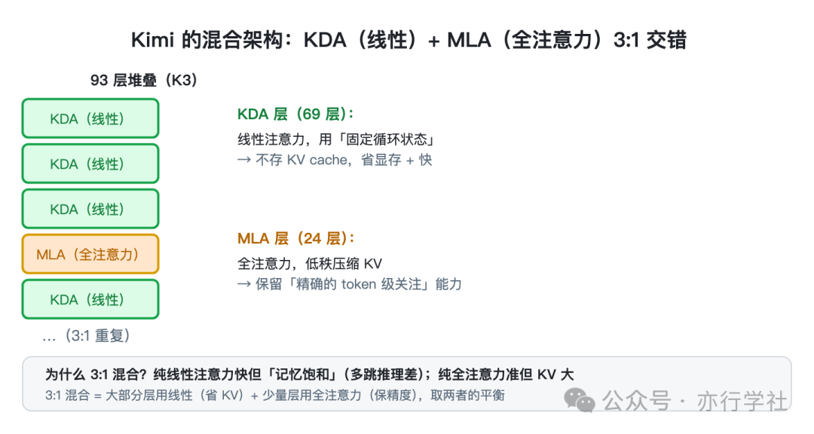

Kimi Linear（K2）：3:1 混合（3 层 KDA + 1 层 MLA），48B 总参数 / 3B 激活，支持 1M 上下文；KV cache 减少 75%，解码吞吐提升 6 倍。

Kimi K3（最新）：93 层（69 层 KDA + 24 层 Gated MLA），FlashKDA 高性能算子，缩放效率是 K2 的 2.5 倍。

6.5 四条路线的本质对比

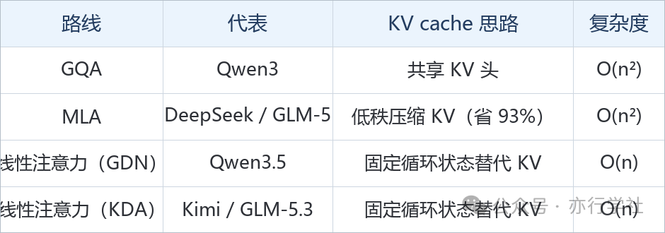

6.6 对内存管理的启示（重点）

线性注意力是「范式级」变化：用「固定大小循环状态」替代「随长度增长的 KV cache」，KV cache 不再随上下文线性增长。如果目标模型走线性注意力，显存压力大减，但存储层级设计要从「KV 分层」转向「循环状态管理」。

但有代价：线性注意力有「记忆饱和」问题（MiniMax 实测 32K 上下文多跳推理有缺陷），所以最新架构都是「3:1 混合」（75% 线性 + 25% 全注意力）折中。

MLA 让推理引擎只需缓存「低维潜向量」，而不是「多头 K/V」——缓存对象本身变了。

收敛趋势：四家最新架构都趋同「线性注意力混合 + 稀疏 + 长上下文」，且都在「长上下文」上卷——Kimi K3 稳定支持 1M。推理系统的 KV cache 设计要兼容「混合架构 + 超长上下文」。

七、参考论文

系统/内核：PagedAttention（vLLM）、FlashAttention / FA-2 / FA-3。

驱逐/稀疏：StreamingLLM、H2O、SnapKV、Longformer、BigBird。

层级存储：InfiniGen、InfLLM。

国产模型架构：MLA（DeepSeek-V2）、Gated DeltaNet（Qwen3.5）、KDA（Kimi）、GLM-5 的 MLA+DSA。

 小 H

 读书 | 思考 | 写作 | 心情
