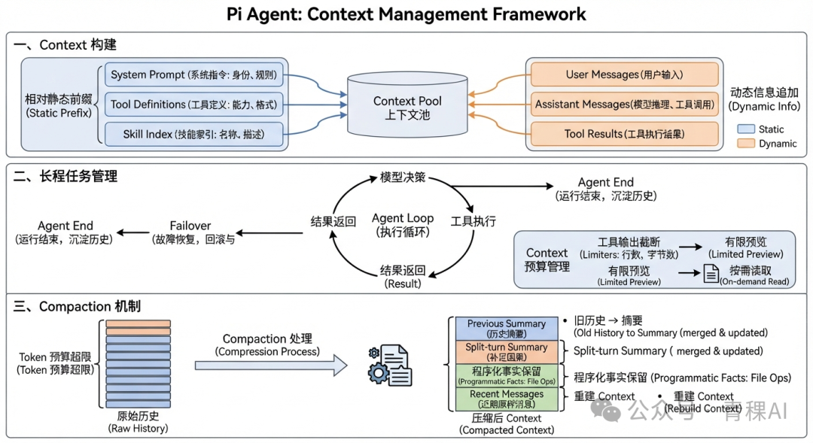

# 到底什么是 Context？万字长文谈 Pi Agent context 管理

> 来源：微信公众号「大模型智能」（转载自「青稞AI」，作者：cecilia）
> 链接（原文）：https://mp.weixin.qq.com/s/Ge5MRAlsqs97MdbINSDSiw
> 日期：2026-09-28（收录于 2026-09-28）
> 抓取说明：微信正文经 curl + 本地 HTML 解析（js_content）提取，正文完整；末尾微信 UI/推荐位文本已剔除
> 性质提示：**技术解析长文（约 14000 字）**，作者以 Pi Agent 源码为对象逐层拆解 Context 管理，含大量内部数据结构定义，属一手工程细节分析；非厂商发布稿
> 关联：Pi 即 `concepts/pi-coding-agent.md` 记录的 **earendil-works 开源终端编码 Agent**（MIT）。本文是该实体页缺失的**内部机制层**——实体页讲"是什么/怎么用"，本文讲"Context 怎么被组装、增长、压缩与重建"
> 原始素材：`raw/assets/pi-agent-context-management-wechat/`（`original.html` 原始网页快照 4.1 MB + 2 张正文配图）——本地留存，随时可查看；原文链接见上

大模型智能｜分享
来源 | 青稞AI
作者 | cecilia

01
前言
写这篇文章，源于我最近在小红书上看到的一个讨论：
Skill 到底是 Prompt，还是 Context？
看下来我发现，这个问题背后其实还有一个更基础的问题：Prompt 和 Context 到底应该怎么区分？
我的理解是，Prompt 更偏向相对静态的指令设计，而 Context 更偏向 Agent 在运行过程中动态形成的信息环境。 Prompt 往往提前定义了模型“应该怎么做”，而 Context 会随着任务推进不断变化，决定模型“此刻基于哪些信息来做”。
所以这篇文章并不想直接讨论 Skill 应该被归类为 Prompt 还是 Context，而是想先回到更基础的问题：
到底什么是context， agent 中是怎么做context管理
本文会以 Pi Agent 为例，看看 Prompt、Skill、Tool Result、Message 等信息是如何被组织，并在 Agent 执行过程中逐步形成模型实际看到的 Context。
全文一共14000 + 字，建议先码后看
02
Context 构建的基本原则
上下文（Context）可以理解为 Agent 在每个决策点能够看到的全部信息。它就像 Agent 当前的“视野”，决定模型基于哪些信息进行下一步推理。
从一次 LLM 调用来看，Context 通常由五部分组成：
• System Prompt：定义 Agent 的身份、规则和工作方式，也可能包含 Memory、环境信息等。

• Tool Definitions：描述 Agent 当前可以使用哪些工具，以及工具的参数格式。

• User Messages：用户输入，也可能包含通过 RAG 动态检索得到的外部知识。

• Assistant Messages：模型此前产生的文本、Reasoning 和 Tool Calls。

• Tool Results：工具执行后返回的结果，为 Agent 下一步决策提供新的信息。

其中，System Prompt 和 Tool Definitions 通常构成相对静态的前缀；User Message、Assistant Message 和 Tool Result 则随着 Agent 执行不断产生和变化。
这些信息并不是由 Model 自己管理的。更准确地说：
Model 负责基于当前 Context 决定下一步；Harness 负责组装和管理 Context、校验并执行工具；Environment 则负责承载真实状态，并产生新的执行结果和观察。
三者不断循环，Context 也会随着 Agent 的执行持续变化。
为了使得上下文是kv cache 友好型，尽量遵守以下三点：
• 保持前缀稳定：System Prompt、Tool Definitions 等静态内容尽量固定，避免频繁修改导致缓存失效。

• 动态信息向后追加：时间、状态、工具结果等变化内容放到 Context 尾部，不要回头修改已有前缀。

• 使用标准消息结构：优先使用 API 原生的 system / user / assistant / tool 等结构化格式，避免自行拼接 Prompt。

03
pi agent 基础概念
由于 Pi Agent 内部定义了一些自己的基础类型和数据结构，后文分析 Context 管理时会频繁涉及。为了避免反复解释，本文先单独用一节介绍这些基础概念，方便理解后续章节解读。
3.1 会话运行层：Runtime 与 Session
Pi Agent 中，AgentSession 和 AgentSessionRuntime 分别对应两个不同层次：
• AgentSession：负责一个具体会话内部如何运行

• AgentSessionRuntime：负责当前使用哪个 Session，以及 Session 的生命周期和运行环境

AgentSession 可以理解为单个会话的控制器。它持有核心 Agent，并负责处理一次会话中的主要运行逻辑，包括 prompt()、abort()、continue()、任务队列、重试、Compaction，以及消息、System Prompt、Tool 和扩展事件的管理。
简单来说：
AgentSession 管的是“这个会话怎么跑”。
而 AgentSessionRuntime 更像是 AgentSession 外层的生命周期容器。它持有当前的 AgentSession，同时维护 Session 运行所依赖的 cwd、settingsManager、modelRuntime、resourceLoader 等 Services。
因此，如果用户只是发送一个 Prompt，主要进入的是 AgentSession 内部的执行流程；而当用户切换 Session 时，则由 AgentSessionRuntime 完成 Session 的替换和重新绑定。
数据结构大致如下
AgentSession = {
agent,
// 底层 agent 执行器。真正负责 prompt/continue，维护 agent.state.messages，并驱动 agent loop。

sessionManager,
// 会话持久化和会话树管理。负责读写 jsonl、追加消息、获取 branch、sessionFile、sessionId 等。

settingsManager,
// 设置管理器。负责读取/修改全局和项目设置，比如默认模型、thinking level、compaction、retry、工具模式等。

modelRuntime,
// 模型运行时。负责模型注册、认证检查、provider 请求、stream 调用、模型列表刷新等。

resourceLoader,
// 资源加载器。负责加载扩展、skills、prompt templates、context files、themes、system prompt 等 cwd 相关资源。

message queues,
// 运行中收到的新消息队列。主要包括 steering、followUp、nextTurn。
// steering 偏“尽快插入当前运行”，followUp 偏“当前回答结束后继续”，nextTurn 会随下一次用户 prompt 一起进上下文。

compaction state,
// 上下文压缩状态。记录当前是否正在 compaction、自动压缩 controller、overflow 恢复是否尝试过等。

retry state,
// 自动重试状态。记录 retry controller、当前重试次数，用于 provider 错误或可恢复错误后的续跑。

bash state,
// bash 命令执行状态。记录正在运行的 bash controller，以及待写入会话/上下文的 bash execution message。

extension state,
// 扩展运行状态。包括 ExtensionRunner、扩展 UI context、扩展命令上下文、shutdown/abort/error handler 等。

tool registry,
// 工具注册表。保存当前可用工具、工具定义、工具 prompt snippet、工具使用 guideline。
// setTools/getTools、扩展工具、内置工具都通过这里统一管理。

system prompt state,
// system prompt 状态。包括基础 system prompt、构建参数，以及本轮临时 override。
// 扩展可以在 before_agent_start 阶段临时改 system prompt，跑完后清掉 override。
}AgentSessionRuntime = {
session,
// 当前正在运行的 AgentSession。用户发 prompt、abort、切模型、压缩等，最终都落到这个对象上。

services,
// 当前会话绑定的一组基础服务。包括 cwd、agentDir、modelRuntime、settingsManager、resourceLoader、diagnostics。
// 切换 session/cwd 时，这组服务会跟着重建。

createRuntime,
// 创建新运行时的工厂函数。new session、resume session、fork/import 时，用它重新创建 services + AgentSession。

diagnostics,
// runtime 初始化或加载资源时产生的诊断信息，比如扩展加载错误、配置问题、模型 fallback 信息等。

rebind hooks,
// 会话替换后的回调。旧 session 被销毁、新 session 创建后，用它通知 UI/host 重新绑定当前 session。
}3.2 Services： Runtime 与 AgentSession 的连接面
在 Pi Agent 中，切换 Session 并不是简单地替换一个 AgentSession 对象。
原因是，一个 Session 往往与当前 cwd 强绑定，而 cwd 又会进一步决定项目配置、AGENTS.md、Extensions、Skills、Prompt Templates、System Prompt，以及模型 Provider 等运行资源。
如果切换了 Session，却仍然沿用旧 Session 的这些依赖，就可能出现类似这样的错配：
当前运行的是 repo-b 的 Session，但实际加载的仍然是 repo-a 的配置、Skill 和扩展。
因此，Pi Agent 引入了 AgentSessionServices，将 cwd、settingsManager、resourceLoader、modelRuntime 等与当前运行环境相关的依赖统一封装起来。
当 AgentSessionRuntime 执行新建、切换、Fork 或恢复 Session 等操作时，会先根据目标 Session 的 cwd 重建对应的 Services，再基于这套运行环境创建新的 AgentSession。
所以，AgentSessionServices 解决的核心问题可以概括为：
切换 Session 时，不只切换会话状态，还要同步切换它所依赖的完整运行环境。
这样可以保证 AgentSession 与项目配置、资源和运行时始终保持一致，避免不同 Session 之间出现环境污染或资源错配。
04
pi的context 管理
4.1 context 的标准化表示
pi 中context 数据结构如下
Context = {
systemPrompt // 当前 agent 的完整系统提示词。它由 AgentSession 构建，来源包括基础 prompt、项目规则、skills 列表、AGENTS/context files、工具说明等。它不会进入 messages 数组，而是作为独立
字段传给底层模型适配层。
messages // 是一个列表，当前会话里模型可见的消息历史
tools // 是一个列表，当前这轮模型可调用的工具列表
}其中大模型 API 的核心是messages，主要包含三种类型：
• UserMessage：用户消息。表示用户输入的内容，可以是文本，也可以包含图片。

• AssistantMessage：模型消息。表示模型返回的结果，既可以包含文本，也可以包含 Tool Call、停止原因和 Token 使用量等信息

• ToolResultMessage：工具结果。Harness 执行 Tool Call 后，会将执行结果包装成 ToolResultMessage，并通过 toolCallId 与对应的 Tool Call 关联。随后，这条消息会被追加回 messages，作为模型下一轮推理的输入。

因此，Pi Agent 中一次典型的 Agent Loop 可以简化为：
UserMessage → AssistantMessage（Tool Call）→ ToolResultMessage → AssistantMessage ...
随着 Agent 不断执行，新的模型回复和工具结果会持续追加到 messages 中，形成不断变化的动态 Context。
4.2 AssistantMessage
AssistantMessage 是 Pi Agent 内部表示模型单轮回复的数据结构。它不仅记录模型生成了什么内容，还会保存本轮是否触发工具调用、停止原因、模型信息和 Token 使用量等元数据。
其中最关键的是 content。它并不只有文本，而是可以同时包含多种内容，例如：
content: [
{ type: "text", text: "我先读取一下文件。" },
{
type: "toolCall",
id: "call_123",
name: "read",
arguments: { path: "src/index.ts" }
}
]因此，一条 AssistantMessage 既可以表示普通文本回复，也可以表示包含 Tool Call 的模型回复。Tool Call 本身不是一条独立消息，而是 AssistantMessage.content 的一部分。
当其中包含 Tool Call 时，后续流程是：
AssistantMessage
↓
发现 toolCall
↓
Pi Agent 执行工具
↓
生成 ToolResultMessage
↓
通过 toolCallId 与原 Tool Call 关联
↓
追加回 messages
↓
继续调用模型也就是说，AssistantMessage 是模型决策的载体，而 ToolResultMessage 则负责把这次决策产生的真实执行结果重新带回 Context。
4.3 ToolResultMessage
ToolResultMessage 不是 Tool 的原始返回值，而是 Agent Loop 对工具执行结果处理后，重新写回 Context 的标准消息。
整体流程是：
1. 模型在 AssistantMessage 中产生一个或多个 Tool Call。

2. Agent Loop 根据配置决定这些 Tool Call 串行或并行执行。

3. 执行前完成工具查找、参数校验，并经过 beforeToolCall Hook。

4. 调用 Tool 的 execute()；异常会被转换成错误结果，而不是直接中断 Agent Loop。

5. 执行结果经过 afterToolCall Hook 后，被封装成 ToolResultMessage：

{
role: "toolResult",
toolCallId: "...",
toolName: "read",
content: [...],
isError: false
}
其中 toolCallId 用于关联对应的 Tool Call。
最终，ToolResultMessage 会被追加回 messages，进入下一轮模型推理。
AssistantMessage
→ Tool Call
→ 串行 / 并行执行
→ beforeToolCall
→ Tool.execute()
→ afterToolCall
→ ToolResultMessage
→ 写回 Context4.4 skill 在上下文的呈现
在 Pi Agent 中，Skill 默认不会把完整的 SKILL.md 直接放进 Context，而是先以 Skill 索引 的形式出现在 System Prompt 中。
每个 Skill 只暴露三类信息：
name Skill 名称
description 适用场景
location SKILL.md 的文件路径例如：
<available_skills>
<skill>
<name>qa-expert</name>
<description>Golang 分布式存储测试专家...</description>
<location>/path/to/qa-expert/SKILL.md</location>
</skill>
</available_skills>这里并没有 Skill 的完整正文。System Prompt 只是告诉模型：当前有哪些 Skill、分别适合什么任务，以及需要时去哪里读取。
因此，Skill 通常分两个阶段进入 Context：
阶段 1：Skill 索引
System Prompt
→ name / description / location

阶段 2：Skill 正文
任务匹配
→ Model 调用 read
→ 读取 SKILL.md
→ 内容进入后续 Context05
长程任务的context 管理
5.1 loop 机制中的context 管理
沿着执行流程看，Context 在 runLoop 运行期间会持续增长：
_runAgentPrompt(用户输入)
│
├─ agent.prompt()
│ └─ runLoop
│ ├─ 模型回复 → 工具执行 → 结果写回 Context
│ ├─ 模型回复 → 工具执行 → 结果继续写回 Context
│ └─ 模型 stop → agent_end
│
├─ _handlePostAgentRun()
│ └─ 可能执行 retry / compaction，进一步调整 Context
│
└─ finally
└─ 清理本轮临时状态，不清空消息历史在 runLoop 内，每完成一轮模型调用和工具执行，产生的 AssistantMessage、ToolResultMessage 都会进入 agent.state.messages。
因此，整个 Run 期间，Context 实际上一直在演进：
Context₀
→ Assistant + ToolResult
→ Context₁
→ Assistant + ToolResult
→ Context₂
→ ...
→ agent_endagent_end 可以看作这一次 Run 中 Context 持续增长阶段的结束点。
但这里的“结束”并不意味着 Context 被清空。
agent.state.messages 会保留下来。finally 中处理的主要是本轮运行相关的临时状态，例如恢复 system prompt、flush 消息以及发出 agent_settled，并不会删除已经沉淀下来的 transcript。
因此，当下一个用户 Prompt 到来时，Agent 会基于当前 state 创建新的 Context Snapshot：
上一个 Run 沉淀的 messages
+
新的 UserMessage
↓
新的 Context
↓
进入下一次 runLoop也就是说，同一个 Session 内，新 Prompt 默认不是从零开始，而是站在之前已经积累的会话历史之上。
例如：
Run 1 结束：

messages =
[
user,
assistant(read),
toolResult,
assistant(edit),
toolResult,
assistant(stop)
]

↓ 用户过一段时间再次输入

Run 2 开始：

messages =
[
Run 1 的历史,
new user
]等待多久本身不会改变这件事。
只要还是同一个 Session，agent.state.messages 就会继续作为后续 Run 的历史来源。区别只是：如果上一轮 Agent 还在运行，新消息可能以 steering / follow-up 的方式进入当前执行；如果上一轮已经 settled，则会开启一个新的 Run。
不过，历史也不会无限增长。
当 Context 超过阈值时，会触发 compaction，把较早的消息折叠成摘要。因此更准确地说，下一个 Prompt 拿到的是：
未发生 compaction：
完整历史 + 新 UserMessage

发生过 compaction：
历史摘要 + 压缩后新增消息 + 新 UserMessage所以从 Context 管理的角度，可以把整个 Session 理解成：
Run 1
Context 持续增长
↓
沉淀到 state

Run 2
从已有 state 创建 Context
↓
继续增长
↓
再次沉淀

Run 3
...核心是：
agent_end 结束的是这一轮 Run 对 Context 的持续更新，而不是 Context 本身。已经产生的消息会沉淀到 Session State 中，成为下一次 Run 的起点；只有 compaction 才会真正改变历史的形态。
5.2 context 预算管理
工具调用是 Context 增长的重要来源，其中 bash 尤其明显。一次命令可能产生大量日志、测试结果甚至完整文件内容，如果全部写进 Context，很容易迅速撑满窗口，而且其中大部分信息模型其实并不需要。
所以这里的核心问题是：
如何把工具输出限制在可控的 Context 预算内，同时又不真正丢失信息。
Pi 的策略可以概括成三步：
1、 预算内，全量保留
输出较小时，直接进入 Context。
2、超过预算，只保留预览
超出部分不再进入 Context，只给模型保留有限的尾部内容。
3、 完整输出落盘，按需读取
完整结果写入临时文件，并把文件路径一起返回给模型。模型如果需要更多细节，可以再通过 read 获取。
整体上就是：
Tool Output
↓
是否超过预算？
├─ 否 → 全量进入 Context
└─ 是 → 截断预览进入 Context
+
完整内容落盘
↓
模型按需读取在实现上，输出是边产生边处理的，而不是等命令结束后再一次性截断。
采集过程中会清理 ANSI、乱码和换行，同时只在内存中维护有限大小的尾部，因此即使命令输出非常大，内存和 Context 消耗也不会随输出无限增长。
预算同时受 行数和字节数限制，例如 2000 行和 50KB，任意一个先达到就触发截断。这样既能处理大量短行，也能防止单行超大的 JSON 等内容绕过限制。
最终模型拿到的不是全部输出，而是：
截断后的预览
+
完整输出文件的位置本质上，这是把工具结果从 “全部推入 Context” 改成了 “有限预览 + 按需读取”，从而把工具输出对 Context 的影响控制在一个可预测的范围内。
5.3 failover 机制的context 管理
长程任务总是免不了需要做failover， 在 Pi Agent 中，可以区分两个层次：
• Agent Context：Agent Loop 内部维护的工作上下文，包括消息历史、System Prompt、Tools 等。

• Model Input：每次调用模型前，由 Agent Context 转换和组装得到的实际模型输入。

Agent Context
→ transform / convert
→ Model Input
→ Model发生 Failover 时，也可以分成两个层级。
Provider 层 Failover 不修改 Agent Context，而是直接使用同一份 Model Input 重新发起请求。对 Agent 来说，这一轮模型调用还没有结束，因此不会产生新的上下文状态。
Session 层 Failover 则发生在一次 Agent Loop 已经失败之后。此时失败的 AssistantMessage 已经进入 Agent Context。Session 会先回滚这条失败消息，再从最近一个有效的 Agent Context 重新启动 Agent Loop，并重新构建 Model Input。
[user]
→ assistant(error)
→ Agent Loop 结束
→ 回滚 assistant(error)
→ [user]
→ 重新构建 Model Input
→ 再次调用 Model因此，两种 Failover 最终发送给模型的 Model Input 可能完全相同，但系统经历的状态路径不同：
Provider Failover 是同一次模型调用的底层重发；Session Failover 是在 Agent 状态已经失败后，先回滚 Context，再重新发起模型调用。
从 Context Management 的角度看，这说明 Context 不只是持续追加，也需要支持 回滚、恢复和重新构建。
06
pi 的compact 机制
6.1 compact 的时间点
Pi Agent 的 Context 压缩不发生在 runLoop 内，而是由 Session 层统一管理。
主要有三个时机：
1、 一次 Agent Run 结束后
Session 会检查当前 Context 是否已经接近上限。如果需要压缩，就先折叠历史，再基于压缩后的 Context 继续执行。
2、 新的 Prompt 发送前
如果上一轮留下的 Context 已经过大，会先压缩，再把新的 User Message 接到压缩后的历史上。
3、 用户手动触发
用户也可以主动执行 /compact，直接压缩当前 Context。
真正触发压缩，主要有两种情况：
Context 持续增长
↓
接近 context window 上限
↓
提前压缩或者：
Context 已经溢出
↓
压缩历史
↓
重新尝试所以从整体 Context 管理来看：
RunLoop 负责不断产生和积累 Context，Session 层则负责在 Run 之间或新 Prompt 到来前检查 Context，并在必要时进行 Compaction。
6.2 compact 实现
整体可以理解成：
原始 Context
↓
根据 token 预算寻找切点
↓
旧历史 → Summary
近期消息 → 原样保留
↓
Summary + Recent Messages
↓
新的 Context总结下来有9个细节点
1. 先决定哪些历史需要压缩
Compaction 首先要解决的是切点问题：哪些消息进入摘要，哪些消息继续原样保留。
Pi 会从最近的消息向前计算 token，用一个固定的 recent-message 预算来保留较新的 Context，其余更早的历史进入压缩区。
切点本质上是 token 预算驱动的，但有一个明确限制：
不能直接切在 Tool Result 上。
因为 Tool Result 本身依赖前面的 Tool Call，如果只留下结果而丢掉调用它的 Assistant Message，会产生明显断裂的 Context。
因此，压缩后的结构通常是：
[较早历史：压缩]
------------------- cut
[近期消息：原样保留]2. 如果切点打断了一个执行过程，就补一份 split-turn 摘要
token 预算是硬约束，所以切点不一定正好落在完整交互边界上。
例如：
Assistant: 我要读取 config.go
Tool Call: read(config.go)
---------------- cut
Tool Result: ...
Assistant: 根据结果继续分析如果前半段被压缩、后半段被保留，模型就可能看到一个缺少来路的执行结果。
Pi 的处理方式不是强行移动切点，而是在确认发生 split-turn 后，额外对被切掉的那部分生成一份摘要：
History Summary
+
Turn Context (split turn)
+
Recent Messages这里的 split-turn summary 是一次独立的 LLM 调用，最后再和主摘要拼接。
它解决的是一个很具体的问题：
压缩可以切断原始消息，但不能切断后续推理所依赖的因果关系。
3. 摘要不是每次从头生成，而是增量合并
第一次 Compaction 时，模型直接总结需要压缩的历史。
但后续再次触发 Compaction 时，不会把最早的所有原始消息重新喂给模型。因为这些消息已经被上一轮摘要替代了。
此时输入变成两部分：
<previous-summary>
上一次已经生成的历史摘要
</previous-summary>

<conversation>
上一次压缩之后新增、这次需要继续折叠的消息
</conversation>模型负责把两部分重新合并成一份新的完整摘要：
Previous Summary
+
新增历史
↓
LLM
↓
Updated Summary所以多次 Compaction 本质上形成的是一个持续演进的摘要：
History₀
↓ compact
Summary₁

Summary₁ + New History
↓ compact
Summary₂

Summary₂ + New History
↓ compact
Summary₃这也是 Pi 能够支持长时间 Agent 执行的关键：旧历史逐渐从原始消息形态转变成摘要形态，而不是无限累积。
4. 摘要本身也有预算
Compaction 并不是“生成摘要就结束”。
如果摘要本身无限增长，经过多轮压缩后最终还是会重新撑满 Context。因此摘要生成也有独立的 token 上限，通常会从预留 Context 预算中划出一部分作为 summary budget。
所以它控制的是两层预算：
原始历史太大
↓
压缩成 Summary

Summary 本身也受 token budget 限制这保证了 Compaction 的结果本身仍然是可控的。
5. 摘要是结构化任务记忆，而不是普通聊天总结
Compaction 的目标也不是“帮用户总结一下刚才聊了什么”。
它更关注的是：为了让 Agent 接着把任务做下去，哪些信息必须留下。
因此摘要会重点保留：
• 当前任务目标；

• 用户约束和偏好；

• 已完成、进行中、受阻的工作；

• 关键决策；

• 已发现的问题和错误；

• 下一步应该继续做什么；

• 关键文件、函数、路径等工程信息。

本质上，它生成的不是 conversation summary，而更接近一份 task continuation state。
6. 对关键事实，不完全依赖 LLM 摘要
Pi 还做了一层很重要的保护：一些能够程序化确定的事实，不交给摘要模型“记忆”。
例如文件操作。
系统会直接扫描历史 Tool Call，提取：
read → 读过哪些文件
write → 新写了哪些文件
edit → 修改过哪些文件最终整理成类似：
<read-files>
...
</read-files>

<modified-files>
...
</modified-files>并追加到摘要中。
这意味着：
语义信息交给 LLM 蒸馏，确定性事实则由程序直接保留。
这是一个很实用的 Context 管理思路，因为像“改过哪些文件”这样的信息一旦被摘要模型漏掉，后续 Agent 很容易重复工作或失去任务锚点。
7. 摘要生成本身不走 Agent Loop
Compaction 的 summary 生成并不是再启动一个完整 Agent。
它只是一次独立的 LLM 调用：
待压缩历史
+
摘要指令
↓
单次 LLM 调用
↓
Summary不会执行工具，也不会进入 Tool Loop。
这样可以避免“为了压缩 Context，又产生更多 Context”的递归问题，也让压缩行为更可控。
8. 摘要生成后，Context 会被真正重建
Compaction 最终不是给现有 messages 做一个标记，而是重新构造 Agent 的消息状态。
压缩之后大致变成：
agent.state.messages =

[
CompactionSummary,
...RecentMessages
]其中 CompactionSummary 是一种专门的消息类型，而不是普通字符串。
在真正构造给 LLM 的 Prompt 时，它会被转换成类似：

此前的历史已经压缩：
...

最近几轮原始消息
...因此，对模型来说：
压缩前：

大量历史原文
+ 最近消息

↓ Compaction

压缩后：

历史摘要
+ 最近消息最近发生的事情保留高保真原文，较远历史则降级成摘要表示。
9. Compaction 记录本身也会被持久化
生成摘要后，Pi 还会保存一条独立的 Compaction 记录，其中包括：
• 本次摘要；

• 压缩边界；

• 压缩前的 token 信息；

• 时间等元数据。

这个记录有两个作用。
第一，它告诉下一次 Compaction：
上一次历史压缩到哪里了，以及 previous summary 是什么。
第二，它让整个压缩过程可追踪，而不是悄悄把历史删掉。
因此，多轮压缩实际上是有连续边界的：
原始历史
↓
Compaction Record 1
↓
新消息继续增长
↓
Compaction Record 2
↓
继续增长整体来看
如果把整个机制压成一条链，就是：
Context 持续增长
↓
逼近 / 超过窗口预算
↓
按 token 预算选择切点
↓
旧历史生成 Summary
│
├─ previous summary 增量合并
├─ split-turn 补足因果
└─ 文件操作程序化保留
↓
Summary + Recent Messages
↓
重建 Context
↓
Agent 继续运行所以 Compaction 本质上不是简单的“截断历史”，而是一种 Context representation transformation：
把远端历史从高成本的原始消息表示，转换成低成本的结构化摘要表示，同时尽可能保留继续完成任务所需要的状态。
如果说 RunLoop 负责的是 Context 的增长，那么 Compaction 负责的就是 Context 的降维与重建。
